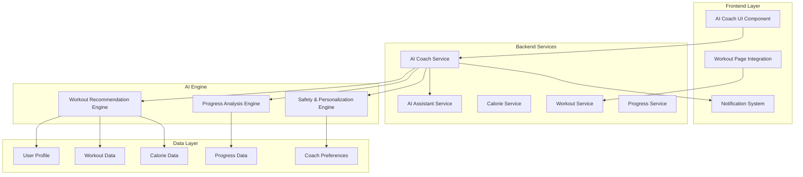

# AI Antrenman Koçu - Tasarım Dökümanı

## Genel Bakış

AI Antrenman Koçu, kullanıcının günlük kalori alımı, kişisel verileri ve antrenman geçmişine dayalı olarak akıllı antrenman programları oluşturan yapay zeka destekli bir sistemdir. Bu özellik mevcut antrenman sayfasına sorunsuz entegre edilecek ve hem yeni başlayanlar hem de deneyimli sporcular için kişiselleştirilmiş, güvenli ve etkili antrenman önerileri sunacaktır.

Sistem, mevcut `WorkoutTracker`, `CalorieEngine` ve `AIAssistantService` bileşenlerini genişleterek kullanıcının kalori dengesi, BMI, yaş, aktivite seviyesi ve antrenman geçmişini analiz eder. Bu analiz sonucunda günlük antrenman önerileri, program güncellemeleri ve motivasyon mesajları sunar.

## Mimari

### Sistem Mimarisi



### Veri Akışı

1. **Kullanıcı Etkileşimi**: Kullanıcı antrenman sayfasını açar
2. **Veri Toplama**: Sistem güncel kalori, profil ve antrenman verilerini toplar
3. **AI Analizi**: Recommendation Engine verileri analiz eder
4. **Öneri Üretimi**: Kişiselleştirilmiş antrenman önerisi oluşturulur
5. **Güvenlik Kontrolü**: Safety Engine önerinin güvenliğini doğrular
6. **Sunum**: Öneri kullanıcıya sunulur
7. **Geri Bildirim**: Kullanıcı etkileşimi Progress Engine'e kaydedilir

## Bileşenler ve Arayüzler

### Backend Bileşenleri

#### 1. AICoachService

```python
class AICoachService:
    """Ana AI koç servisi - tüm koç işlevlerini koordine eder"""
    
    async def get_daily_recommendation(
        self, 
        user_id: int, 
        db: AsyncSession
    ) -> WorkoutRecommendation:
        """Günlük antrenman önerisi oluşturur"""
        
    async def update_program_difficulty(
        self, 
        user_id: int, 
        performance_data: PerformanceData,
        db: AsyncSession
    ) -> ProgramUpdate:
        """Program zorluğunu kullanıcı performansına göre günceller"""
        
    async def get_motivation_message(
        self, 
        user_id: int, 
        context: str,
        db: AsyncSession
    ) -> str:
        """Kişiselleştirilmiş motivasyon mesajı üretir"""
```

#### 2. WorkoutRecommendationEngine

```python
class WorkoutRecommendationEngine:
    """Antrenman önerisi oluşturma motoru"""
    
    async def analyze_calorie_balance(
        self, 
        user_data: UserAnalysisData
    ) -> CalorieAnalysis:
        """Kalori dengesini analiz eder"""
        
    async def determine_workout_intensity(
        self, 
        calorie_analysis: CalorieAnalysis,
        user_profile: UserProfile
    ) -> WorkoutIntensity:
        """Antrenman yoğunluğunu belirler"""
        
    async def generate_workout_plan(
        self, 
        intensity: WorkoutIntensity,
        user_preferences: UserPreferences,
        safety_constraints: SafetyConstraints
    ) -> WorkoutPlan:
        """Antrenman planı oluşturur"""
```

#### 3. ProgressAnalysisEngine

```python
class ProgressAnalysisEngine:
    """İlerleme analizi ve program adaptasyonu"""
    
    async def analyze_weekly_performance(
        self, 
        user_id: int,
        weeks: int,
        db: AsyncSession
    ) -> PerformanceAnalysis:
        """Haftalık performansı analiz eder"""
        
    async def detect_adaptation_needs(
        self, 
        performance: PerformanceAnalysis
    ) -> AdaptationRecommendation:
        """Program adaptasyon ihtiyaçlarını tespit eder"""
        
    async def calculate_progress_score(
        self, 
        user_data: UserProgressData
    ) -> ProgressScore:
        """İlerleme skorunu hesaplar"""
```

#### 4. SafetyPersonalizationEngine

```python
class SafetyPersonalizationEngine:
    """Güvenlik kontrolü ve kişiselleştirme"""
    
    async def validate_workout_safety(
        self, 
        workout: WorkoutPlan,
        user_profile: UserProfile,
        health_constraints: HealthConstraints
    ) -> SafetyValidation:
        """Antrenman güvenliğini doğrular"""
        
    async def apply_age_adjustments(
        self, 
        workout: WorkoutPlan,
        age: int
    ) -> WorkoutPlan:
        """Yaşa göre antrenman ayarlamaları yapar"""
        
    async def apply_injury_modifications(
        self, 
        workout: WorkoutPlan,
        injury_history: List[InjuryRecord]
    ) -> WorkoutPlan:
        """Yaralanma geçmişine göre modifikasyonlar yapar"""
```

### Frontend Bileşenleri

#### 1. AICoachWidget

```typescript
interface AICoachWidgetProps {
  userId: number;
  onRecommendationAccept: (recommendation: WorkoutRecommendation) => void;
  onFeedback: (feedback: CoachFeedback) => void;
}

const AICoachWidget: React.FC<AICoachWidgetProps> = ({
  userId,
  onRecommendationAccept,
  onFeedback
}) => {
  // AI koç widget implementasyonu
}
```

#### 2. WorkoutRecommendationCard

```typescript
interface WorkoutRecommendationCardProps {
  recommendation: WorkoutRecommendation;
  onAccept: () => void;
  onModify: () => void;
  onReject: () => void;
}

const WorkoutRecommendationCard: React.FC<WorkoutRecommendationCardProps> = ({
  recommendation,
  onAccept,
  onModify,
  onReject
}) => {
  // Antrenman önerisi kartı implementasyonu
}
```

#### 3. ProgressInsightPanel

```typescript
interface ProgressInsightPanelProps {
  userId: number;
  timeframe: 'week' | 'month' | 'quarter';
}

const ProgressInsightPanel: React.FC<ProgressInsightPanelProps> = ({
  userId,
  timeframe
}) => {
  // İlerleme analizi paneli implementasyonu
}
```

### API Arayüzleri

#### Coach Endpoints

```python
# /api/coach/recommendation
@router.get("/recommendation")
async def get_daily_recommendation(
    current_user: User = Depends(get_current_user),
    db: AsyncSession = Depends(get_db)
) -> WorkoutRecommendationResponse:
    """Günlük antrenman önerisi getirir"""

# /api/coach/feedback
@router.post("/feedback")
async def submit_feedback(
    feedback: CoachFeedbackRequest,
    current_user: User = Depends(get_current_user),
    db: AsyncSession = Depends(get_db)
) -> FeedbackResponse:
    """Kullanıcı geri bildirimini kaydeder"""

# /api/coach/progress
@router.get("/progress")
async def get_progress_insights(
    weeks: int = Query(4, ge=1, le=52),
    current_user: User = Depends(get_current_user),
    db: AsyncSession = Depends(get_db)
) -> ProgressInsightsResponse:
    """İlerleme analizini getirir"""
```

## Veri Modelleri

### Yeni Veritabanı Tabloları

#### 1. AICoachRecommendation

```python
class AICoachRecommendation(Base):
    __tablename__ = "ai_coach_recommendations"
    
    id = Column(Integer, primary_key=True, index=True)
    user_id = Column(Integer, ForeignKey("user_profiles.id"), nullable=False)
    recommendation_date = Column(Date, nullable=False)
    workout_type = Column(String(50), nullable=False)  # cardio, strength, mixed
    intensity_level = Column(String(20), nullable=False)  # low, medium, high
    duration_minutes = Column(Integer, nullable=False)
    calorie_balance_factor = Column(Float, nullable=False)
    exercises = Column(JSON, nullable=False)  # Liste of exercises
    reasoning = Column(Text, nullable=True)  # AI'nin gerekçesi
    status = Column(String(20), default="pending")  # pending, accepted, rejected, completed
    user_feedback = Column(Integer, nullable=True)  # 1-5 rating
    created_at = Column(DateTime, default=datetime.utcnow)
    updated_at = Column(DateTime, default=datetime.utcnow, onupdate=datetime.utcnow)
```

#### 2. AICoachProgress

```python
class AICoachProgress(Base):
    __tablename__ = "ai_coach_progress"
    
    id = Column(Integer, primary_key=True, index=True)
    user_id = Column(Integer, ForeignKey("user_profiles.id"), nullable=False)
    analysis_date = Column(Date, nullable=False)
    performance_score = Column(Float, nullable=False)  # 0-100
    consistency_score = Column(Float, nullable=False)  # 0-100
    adaptation_needed = Column(Boolean, default=False)
    adaptation_type = Column(String(50), nullable=True)  # increase, decrease, maintain
    weekly_completion_rate = Column(Float, nullable=False)  # 0-1
    average_intensity = Column(Float, nullable=False)
    progress_trend = Column(String(20), nullable=False)  # improving, stable, declining
    recommendations_count = Column(Integer, default=0)
    accepted_count = Column(Integer, default=0)
    created_at = Column(DateTime, default=datetime.utcnow)
```

#### 3. AICoachPreferences

```python
class AICoachPreferences(Base):
    __tablename__ = "ai_coach_preferences"
    
    id = Column(Integer, primary_key=True, index=True)
    user_id = Column(Integer, ForeignKey("user_profiles.id"), nullable=False, unique=True)
    preferred_workout_types = Column(JSON, nullable=False)  # ["cardio", "strength"]
    avoided_exercises = Column(JSON, nullable=True)  # Kaçınılan egzersizler
    max_workout_duration = Column(Integer, default=90)  # dakika
    preferred_intensity = Column(String(20), default="medium")
    injury_history = Column(JSON, nullable=True)  # Yaralanma geçmişi
    health_conditions = Column(JSON, nullable=True)  # Sağlık durumları
    motivation_style = Column(String(20), default="encouraging")  # encouraging, challenging
    notification_preferences = Column(JSON, nullable=False)
    created_at = Column(DateTime, default=datetime.utcnow)
    updated_at = Column(DateTime, default=datetime.utcnow, onupdate=datetime.utcnow)
```

### Veri Transfer Objeleri (DTOs)

#### WorkoutRecommendation

```python
class WorkoutRecommendation(BaseModel):
    id: Optional[int] = None
    workout_type: str
    intensity_level: str
    duration_minutes: int
    exercises: List[ExerciseRecommendation]
    reasoning: str
    calorie_context: CalorieContext
    safety_notes: List[str]
    estimated_calories_burned: int
    motivation_message: str
    created_at: datetime
```

#### ExerciseRecommendation

```python
class ExerciseRecommendation(BaseModel):
    name: str
    category: str  # cardio, strength, flexibility
    sets: Optional[int] = None
    reps: Optional[int] = None
    duration_seconds: Optional[int] = None
    rest_seconds: int
    intensity: str  # low, medium, high
    instructions: str
    modifications: List[str]  # Modifikasyonlar
    target_muscles: List[str]
```

#### CalorieContext

```python
class CalorieContext(BaseModel):
    daily_target: int
    current_intake: int
    balance: int  # intake - target
    balance_percentage: float
    recommendation_reason: str
```

## Hata Yönetimi

### Hata Türleri ve Yönetimi

#### 1. AI Servisi Hataları

```python
class AICoachException(Exception):
    """AI Coach genel hata sınıfı"""
    pass

class RecommendationGenerationError(AICoachException):
    """Öneri oluşturma hatası"""
    pass

class SafetyValidationError(AICoachException):
    """Güvenlik doğrulama hatası"""
    pass

class InsufficientDataError(AICoachException):
    """Yetersiz veri hatası"""
    pass
```

#### 2. Hata Yönetim Stratejisi

```python
async def get_daily_recommendation_with_fallback(
    user_id: int, 
    db: AsyncSession
) -> WorkoutRecommendation:
    """Hata durumunda fallback öneriler sunar"""
    try:
        return await ai_coach_service.get_daily_recommendation(user_id, db)
    except RecommendationGenerationError:
        # Basit template-based öneri sun
        return await get_template_recommendation(user_id, db)
    except InsufficientDataError:
        # Veri toplama önerisi sun
        return await get_data_collection_recommendation(user_id, db)
    except Exception as e:
        # Genel hata - güvenli varsayılan öneri
        logger.error(f"AI Coach error for user {user_id}: {e}")
        return await get_safe_default_recommendation(user_id, db)
```

#### 3. Graceful Degradation

- **AI Servisi Çevrimdışı**: Template-based öneriler
- **Yetersiz Veri**: Veri toplama rehberi
- **Yüksek Yük**: Önbelleğe alınmış öneriler
- **Güvenlik Hatası**: Konservatif güvenli öneriler

### Logging ve Monitoring

```python
class AICoachLogger:
    """AI Coach özel logging sistemi"""
    
    @staticmethod
    def log_recommendation_generated(
        user_id: int, 
        recommendation: WorkoutRecommendation,
        generation_time_ms: int
    ):
        """Öneri oluşturma logları"""
        
    @staticmethod
    def log_user_feedback(
        user_id: int, 
        recommendation_id: int,
        feedback_type: str,
        rating: Optional[int]
    ):
        """Kullanıcı geri bildirim logları"""
        
    @staticmethod
    def log_safety_violation(
        user_id: int, 
        violation_type: str,
        details: str
    ):
        """Güvenlik ihlali logları"""
```

## Test Stratejisi

### Unit Test Stratejisi

#### 1. AI Coach Service Tests

```python
class TestAICoachService:
    """AI Coach servis testleri"""
    
    async def test_daily_recommendation_generation(self):
        """Günlük öneri oluşturma testi"""
        
    async def test_calorie_balance_analysis(self):
        """Kalori dengesi analizi testi"""
        
    async def test_safety_validation(self):
        """Güvenlik doğrulama testi"""
        
    async def test_progress_tracking(self):
        """İlerleme takibi testi"""
```

#### 2. Recommendation Engine Tests

```python
class TestRecommendationEngine:
    """Öneri motoru testleri"""
    
    async def test_intensity_calculation(self):
        """Yoğunluk hesaplama testi"""
        
    async def test_exercise_selection(self):
        """Egzersiz seçimi testi"""
        
    async def test_personalization(self):
        """Kişiselleştirme testi"""
```

#### 3. Safety Engine Tests

```python
class TestSafetyEngine:
    """Güvenlik motoru testleri"""
    
    async def test_age_based_limitations(self):
        """Yaş bazlı sınırlamalar testi"""
        
    async def test_injury_modifications(self):
        """Yaralanma modifikasyonları testi"""
        
    async def test_duration_limits(self):
        """Süre sınırları testi"""
```

### Integration Test Stratejisi

#### 1. End-to-End Workflow Tests

```python
class TestAICoachWorkflow:
    """Tam iş akışı testleri"""
    
    async def test_complete_recommendation_flow(self):
        """Tam öneri akışı testi"""
        # 1. Kullanıcı verilerini al
        # 2. Öneri oluştur
        # 3. Güvenlik kontrolü yap
        # 4. Kullanıcıya sun
        # 5. Geri bildirim al
        # 6. İlerleme kaydet
        
    async def test_program_adaptation_flow(self):
        """Program adaptasyon akışı testi"""
        
    async def test_error_recovery_flow(self):
        """Hata kurtarma akışı testi"""
```

#### 2. API Integration Tests

```python
class TestAICoachAPI:
    """API entegrasyon testleri"""
    
    async def test_recommendation_endpoint(self):
        """Öneri endpoint testi"""
        
    async def test_feedback_endpoint(self):
        """Geri bildirim endpoint testi"""
        
    async def test_progress_endpoint(self):
        """İlerleme endpoint testi"""
```

### Performance Test Stratejisi

#### 1. Load Testing

- **Eş zamanlı kullanıcı sayısı**: 1000 kullanıcı
- **Öneri oluşturma süresi**: < 5 saniye
- **API yanıt süresi**: < 2 saniye
- **Veritabanı sorgu optimizasyonu**

#### 2. Stress Testing

- **Yoğun yük altında performans**
- **Bellek kullanımı optimizasyonu**
- **AI model yanıt süreleri**
- **Fallback mekanizma testleri**

## Correctness Properties

*A property is a characteristic or behavior that should hold true across all valid executions of a system-essentially, a formal statement about what the system should do. Properties serve as the bridge between human-readable specifications and machine-verifiable correctness guarantees.*

### Property Reflection

After analyzing all acceptance criteria, I identified several areas of redundancy that need consolidation:

1. **Calorie-based recommendations** (1.1, 1.2, 1.3, 3.1, 3.2, 3.3) can be consolidated into comprehensive calorie balance properties
2. **User profile-based adaptations** (2.2, 2.3, 2.4, 2.5, 2.6) can be combined into profile-driven recommendation properties  
3. **Safety and health considerations** (7.1, 7.2, 7.4, 7.6) can be unified into safety validation properties
4. **Progress tracking metrics** (4.1, 4.6) can be combined into comprehensive tracking properties

### Property 1: Calorie Balance Determines Workout Type and Intensity

*For any* user with calculated calorie balance, the AI Coach SHALL recommend workout type and intensity according to the balance: calorie surplus (>120% of target) results in high-intensity cardiovascular workouts, calorie deficit (<80% of target) results in low-intensity strength training, and balanced intake (80-120% of target) results in medium-intensity mixed workouts.

**Validates: Requirements 1.1, 1.2, 1.3, 3.1, 3.2, 3.3**

### Property 2: User Profile Drives Personalized Recommendations

*For any* user profile containing age, activity level, and BMI data, the AI Coach SHALL generate recommendations that respect age-based intensity limits (high intensity for 18-30, low-impact for 50+), activity level appropriateness (beginner for sedentary, intermediate-advanced for active), and BMI-adjusted workout intensity.

**Validates: Requirements 2.1, 2.2, 2.3, 2.4, 2.5, 2.6**

### Property 3: Calorie Balance Calculation Accuracy

*For any* daily calorie intake and target values, the calorie balance calculation SHALL equal intake minus target, and the balance percentage SHALL equal (intake/target) * 100.

**Validates: Requirements 1.4**

### Property 4: Workout Duration Adjustment Based on Calorie Intake

*For any* user with low calorie intake (below target), the AI Coach SHALL reduce recommended workout duration by exactly 25% from the base duration.

**Validates: Requirements 3.5**

### Property 5: Progress-Based Difficulty Adaptation

*For any* user with completion rate below 50%, the AI Coach SHALL decrease workout difficulty level, and for any user completing workouts easily for 3+ weeks, the difficulty level SHALL be increased.

**Validates: Requirements 4.2, 4.3**

### Property 6: Comprehensive Progress Tracking

*For any* workout session, the Progress Tracker SHALL record frequency (sessions per week), duration (minutes per session), and intensity level, and SHALL generate monthly progress reports containing all tracked metrics.

**Validates: Requirements 4.1, 4.4, 4.6**

### Property 7: Goal Achievement Triggers New Recommendations

*For any* user who achieves their current fitness goal, the AI Coach SHALL automatically generate and propose a new appropriate goal based on their progress and preferences.

**Validates: Requirements 4.5**

### Property 8: Neglected Muscle Group Compensation

*For any* user whose workout history shows neglect of specific muscle groups (less than recommended frequency), the AI Coach SHALL prioritize those muscle groups in subsequent workout recommendations.

**Validates: Requirements 5.2**

### Property 9: User Preference Learning and Application

*For any* user interaction pattern showing consistent preferences or avoidances (e.g., avoiding cardio), the AI Coach SHALL learn these preferences and adapt recommendations accordingly, offering alternatives when preferred activities are avoided.

**Validates: Requirements 5.3, 5.4**

### Property 10: Contextual Motivation and Activity Recommendations

*For any* user state (pre-workout, rest day, low energy), the AI Coach SHALL provide appropriate contextual recommendations: motivational messages before workouts, active recovery activities on rest days, and energy-appropriate workout modifications.

**Validates: Requirements 5.5, 5.6**

### Property 11: Automatic Workout Logging Integration

*For any* accepted workout recommendation, the AI Coach SHALL automatically log the workout into the existing workout tracking system without requiring additional user input.

**Validates: Requirements 6.6**

### Property 12: Safety Constraint Enforcement

*For any* workout recommendation, the AI Coach SHALL enforce safety constraints: maximum 90-minute duration, inclusion of warm-up and cool-down exercises, protective modifications for users with injury history, and rest day recommendations for users showing fatigue indicators.

**Validates: Requirements 7.2, 7.3, 7.4, 7.5**

### Property 13: Health Condition Accommodation

*For any* user with reported health conditions or injury history, the AI Coach SHALL modify workout recommendations to accommodate these conditions and SHALL recommend medical consultation for users reporting new health issues.

**Validates: Requirements 7.1, 7.6**

### Property 14: Data Integration and Utilization

*For any* existing user data (profile, workout history, calorie data), the AI Coach SHALL automatically access and utilize this data for generating personalized recommendations without requiring manual data entry.

**Validates: Requirements 6.4**

### User Acceptance Testing

#### 1. Usability Testing

- **Arayüz kullanılabilirliği**
- **Öneri kalitesi değerlendirmesi**
- **Motivasyon mesajları etkinliği**
- **Türkçe dil desteği kalitesi**

#### 2. A/B Testing

- **Farklı öneri algoritmaları**
- **Motivasyon mesajı stilleri**
- **Arayüz tasarım alternatifleri**
- **Bildirim zamanlamaları**