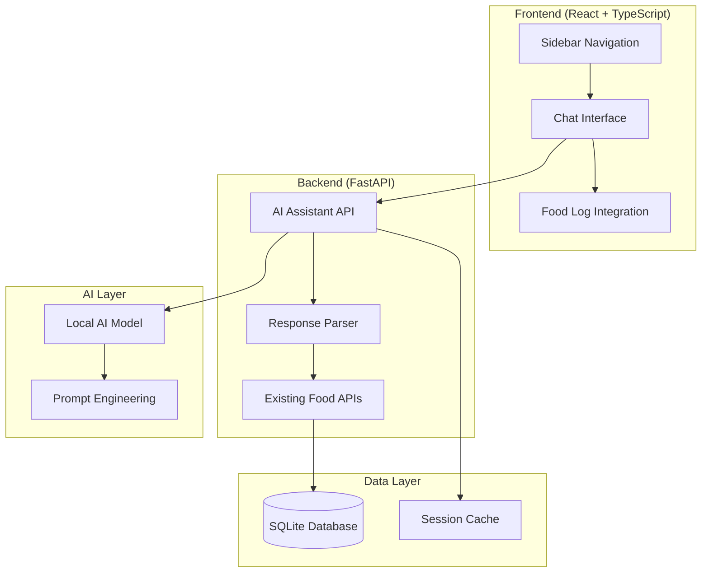

# Design Document: AI Besin Asistanı

## Overview

AI Besin Asistanı, mevcut fitness takip uygulamasına entegre edilecek yeni bir özelliktir. Bu sistem, kullanıcıların mevcut besin veritabanında bulunmayan yiyecekler için besin değerlerini öğrenmelerine yardımcı olacak bir yapay zeka asistanı sağlar.

### Core Design Principles

1. **Seamless Integration**: Mevcut glassmorphism tasarım diliyle tutarlı, sidebar navigasyonuna yeni bir menü öğesi olarak entegre
2. **Local-First AI**: Ücretsiz ve yerel olarak çalışan AI modelleri kullanarak dış bağımlılıkları minimize etme
3. **Turkish Language Support**: Tam Türkçe dil desteği ile yerel kullanıcı deneyimi
4. **Progressive Enhancement**: Mevcut manuel besin girme sistemini destekleyici, değiştirici değil
5. **Performance Optimization**: Sohbet geçmişi yönetimi ve kaynak optimizasyonu

### Technical Context

Sistem, mevcut FastAPI backend ve React TypeScript frontend üzerine inşa edilecektir. Mevcut besin arama sistemi (`/foods/search`) ve kalori günlüğü (`/log/`) API'leri ile entegre çalışacaktır.

## Architecture

### High-Level Architecture



### Component Architecture

The system follows a layered architecture pattern:

1. **Presentation Layer**: React components with glassmorphism UI
2. **API Layer**: FastAPI routers handling AI requests
3. **Business Logic Layer**: AI model integration and response processing
4. **Data Access Layer**: SQLite database operations for session management

### Integration Points

- **Sidebar Navigation**: New menu item "AI Besin Asistanı"
- **Food Log System**: Direct integration for adding AI-suggested foods
- **Existing APIs**: Leverages current food search and logging endpoints
- **UI Components**: Reuses existing GlassCard, Button, Input components

## Components and Interfaces

### Frontend Components

#### 1. AIAssistant Page Component
```typescript
interface AIAssistantProps {
  // Main page component for AI assistant
}

interface ChatMessage {
  id: string
  type: 'user' | 'assistant'
  content: string
  timestamp: Date
  nutritionData?: NutritionData
}

interface NutritionData {
  calories: number
  protein: number
  carbs: number
  fat: number
  foodName: string
  confidence: 'high' | 'medium' | 'low'
}
```

#### 2. ChatInterface Component
```typescript
interface ChatInterfaceProps {
  messages: ChatMessage[]
  onSendMessage: (message: string) => void
  isLoading: boolean
  error?: string
}
```

#### 3. NutritionCard Component
```typescript
interface NutritionCardProps {
  nutrition: NutritionData
  onAddToLog: (nutrition: NutritionData) => void
  showAddButton: boolean
}
```

#### 4. MessageBubble Component
```typescript
interface MessageBubbleProps {
  message: ChatMessage
  onAddToLog?: (nutrition: NutritionData) => void
}
```

### Backend Components

#### 1. AI Assistant Router
```python
# /api/ai-assistant/
@router.post("/chat")
async def chat_with_ai(request: ChatRequest) -> ChatResponse

@router.get("/session/{session_id}")
async def get_session_history(session_id: str) -> SessionHistory

@router.delete("/session/{session_id}")
async def clear_session(session_id: str) -> StatusResponse
```

#### 2. AI Service Layer
```python
class AIAssistantService:
    async def process_nutrition_query(self, query: str, session_id: str) -> AIResponse
    async def parse_nutrition_response(self, ai_response: str) -> Optional[NutritionData]
    async def get_session_context(self, session_id: str) -> List[ChatMessage]
    async def save_message(self, session_id: str, message: ChatMessage) -> None
```

#### 3. Local AI Integration
```python
class LocalAIModel:
    def __init__(self, model_path: str)
    async def generate_response(self, prompt: str, context: List[str]) -> str
    def is_available(self) -> bool
    async def initialize(self) -> bool
```

### API Interfaces

#### Chat Request/Response
```python
class ChatRequest(BaseModel):
    message: str
    session_id: str
    user_id: int = 1

class ChatResponse(BaseModel):
    response: str
    nutrition_data: Optional[NutritionData] = None
    session_id: str
    timestamp: datetime
    error: Optional[str] = None

class NutritionData(BaseModel):
    food_name: str
    calories_per_100g: float
    protein_per_100g: float
    carbs_per_100g: float
    fat_per_100g: float
    confidence: Literal["high", "medium", "low"]
    source: str = "ai_assistant"
```

#### Session Management
```python
class SessionHistory(BaseModel):
    session_id: str
    messages: List[ChatMessage]
    created_at: datetime
    last_activity: datetime

class ChatMessage(BaseModel):
    id: str
    type: Literal["user", "assistant"]
    content: str
    timestamp: datetime
    nutrition_data: Optional[NutritionData] = None
```

## Data Models

### Database Schema Extensions

#### 1. AI Chat Sessions Table
```sql
CREATE TABLE ai_chat_sessions (
    id TEXT PRIMARY KEY,
    user_id INTEGER NOT NULL,
    created_at DATETIME DEFAULT CURRENT_TIMESTAMP,
    last_activity DATETIME DEFAULT CURRENT_TIMESTAMP,
    message_count INTEGER DEFAULT 0
);
```

#### 2. AI Chat Messages Table
```sql
CREATE TABLE ai_chat_messages (
    id TEXT PRIMARY KEY,
    session_id TEXT NOT NULL,
    message_type TEXT NOT NULL CHECK (message_type IN ('user', 'assistant')),
    content TEXT NOT NULL,
    nutrition_data TEXT, -- JSON string for structured nutrition data
    timestamp DATETIME DEFAULT CURRENT_TIMESTAMP,
    FOREIGN KEY (session_id) REFERENCES ai_chat_sessions(id) ON DELETE CASCADE
);
```

#### 3. AI Generated Foods Table
```sql
CREATE TABLE ai_generated_foods (
    id INTEGER PRIMARY KEY AUTOINCREMENT,
    session_id TEXT NOT NULL,
    message_id TEXT NOT NULL,
    food_name TEXT NOT NULL,
    calories_per_100g REAL NOT NULL,
    protein_per_100g REAL NOT NULL,
    carbs_per_100g REAL NOT NULL,
    fat_per_100g REAL NOT NULL,
    confidence TEXT NOT NULL CHECK (confidence IN ('high', 'medium', 'low')),
    created_at DATETIME DEFAULT CURRENT_TIMESTAMP,
    FOREIGN KEY (session_id) REFERENCES ai_chat_sessions(id) ON DELETE CASCADE
);
```

### SQLAlchemy Models

```python
class AIChatSession(Base):
    __tablename__ = "ai_chat_sessions"
    
    id: Mapped[str] = mapped_column(String, primary_key=True)
    user_id: Mapped[int] = mapped_column(Integer, nullable=False)
    created_at: Mapped[datetime] = mapped_column(DateTime, default=func.now())
    last_activity: Mapped[datetime] = mapped_column(DateTime, default=func.now())
    message_count: Mapped[int] = mapped_column(Integer, default=0)
    
    messages: Mapped[List["AIChatMessage"]] = relationship(
        "AIChatMessage", back_populates="session", cascade="all, delete-orphan"
    )

class AIChatMessage(Base):
    __tablename__ = "ai_chat_messages"
    
    id: Mapped[str] = mapped_column(String, primary_key=True)
    session_id: Mapped[str] = mapped_column(String, ForeignKey("ai_chat_sessions.id"))
    message_type: Mapped[str] = mapped_column(String, nullable=False)
    content: Mapped[str] = mapped_column(Text, nullable=False)
    nutrition_data: Mapped[Optional[str]] = mapped_column(Text, nullable=True)
    timestamp: Mapped[datetime] = mapped_column(DateTime, default=func.now())
    
    session: Mapped["AIChatSession"] = relationship("AIChatSession", back_populates="messages")

class AIGeneratedFood(Base):
    __tablename__ = "ai_generated_foods"
    
    id: Mapped[int] = mapped_column(Integer, primary_key=True)
    session_id: Mapped[str] = mapped_column(String, ForeignKey("ai_chat_sessions.id"))
    message_id: Mapped[str] = mapped_column(String, nullable=False)
    food_name: Mapped[str] = mapped_column(String, nullable=False)
    calories_per_100g: Mapped[float] = mapped_column(Float, nullable=False)
    protein_per_100g: Mapped[float] = mapped_column(Float, nullable=False)
    carbs_per_100g: Mapped[float] = mapped_column(Float, nullable=False)
    fat_per_100g: Mapped[float] = mapped_column(Float, nullable=False)
    confidence: Mapped[str] = mapped_column(String, nullable=False)
    created_at: Mapped[datetime] = mapped_column(DateTime, default=func.now())
```

## Correctness Properties

*A property is a characteristic or behavior that should hold true across all valid executions of a system-essentially, a formal statement about what the system should do. Properties serve as the bridge between human-readable specifications and machine-verifiable correctness guarantees.*

### Property 1: Turkish Language Response Consistency

*For any* nutrition query submitted to the AI assistant, the response SHALL be in Turkish language with proper Turkish character encoding support.

**Validates: Requirements 2.1, 2.3, 2.4, 2.5**

### Property 2: Complete Nutrition Information Provision

*For any* valid nutrition query, the AI assistant SHALL provide all four required nutrition components (calories, protein, carbohydrates, and fat per 100g) in a structured format.

**Validates: Requirements 3.1, 3.2, 3.3, 3.4, 3.5**

### Property 3: Conversation History Persistence

*For any* message sent during a user session, the message SHALL appear in the conversation history and persist until the user navigates away from the page.

**Validates: Requirements 4.1, 4.6**

### Property 4: UI Responsiveness During Processing

*For any* user interaction that triggers AI processing, the chat interface SHALL remain responsive and display appropriate loading indicators.

**Validates: Requirements 4.4, 10.4**

### Property 5: Auto-scroll Behavior

*For any* new message added to the conversation, the chat interface SHALL automatically scroll to display the latest message.

**Validates: Requirements 4.5**

### Property 6: AI Model Performance Requirements

*For any* nutrition query under normal conditions, the local AI model SHALL respond within 10 seconds.

**Validates: Requirements 5.6**

### Property 7: Nutrition Data Extraction

*For any* AI response containing nutrition information, the response parser SHALL successfully extract structured nutrition data including all required components.

**Validates: Requirements 6.1, 6.2**

### Property 8: Nutrition Value Validation

*For any* parsed nutrition values, the system SHALL validate that calories are between 0-900 per 100g and macronutrients are between 0-100g per 100g.

**Validates: Requirements 6.4**

### Property 9: Food Log Integration

*For any* structured nutrition information provided by the AI, the system SHALL display an "Add to Food Log" button and correctly pre-populate the food entry form when clicked.

**Validates: Requirements 7.1, 7.2**

### Property 10: Manual Entry Storage

*For any* AI-suggested food added to the log, the system SHALL store it as a manual entry without linking to existing Food_Database items.

**Validates: Requirements 7.5**

### Property 11: Responsive Design

*For any* screen size or viewport, the chat interface SHALL maintain proper responsive behavior and usability.

**Validates: Requirements 8.3**

### Property 12: Loading State Consistency

*For any* loading state triggered in the AI assistant, the visual indicators SHALL match the existing application's loading patterns.

**Validates: Requirements 8.5**

### Property 13: Error Handling and Retry

*For any* AI request failure, the system SHALL provide retry functionality and display user-friendly error messages in Turkish.

**Validates: Requirements 9.4, 9.5**

### Property 14: Memory Management

*For any* conversation session, the system SHALL limit conversation history to the last 50 messages to manage memory usage effectively.

**Validates: Requirements 10.1**

### Property 15: Concurrent Request Handling

*For any* multiple simultaneous queries, the system SHALL handle them gracefully through request queuing without blocking the interface.

**Validates: Requirements 10.3**

### Property 16: Progress Indication

*For any* AI request taking longer than 3 seconds, the system SHALL display progress indicators to inform the user of ongoing processing.

**Validates: Requirements 10.5**

## Error Handling

### Error Categories and Strategies

#### 1. AI Model Errors
- **Connection Failures**: Display Turkish error message with retry option
- **Model Unavailable**: Show fallback message suggesting manual food entry
- **Timeout Errors**: Provide retry with progress indication
- **Response Generation Failures**: Log error, show user-friendly message

#### 2. Parsing Errors
- **Unparseable Responses**: Display raw AI response with interpretation note
- **Invalid Nutrition Values**: Fall back to raw response display
- **Missing Data**: Request clarification from user

#### 3. Integration Errors
- **Food Log API Failures**: Show error message, allow manual retry
- **Session Management Errors**: Clear session, restart conversation
- **Database Connection Issues**: Graceful degradation with in-memory storage

#### 4. User Input Errors
- **Empty Queries**: Show validation message in Turkish
- **Invalid Characters**: Handle gracefully with Turkish character support
- **Too Long Messages**: Truncate with warning message

### Error Recovery Mechanisms

```python
class ErrorRecoveryService:
    async def handle_ai_error(self, error: AIError, context: ChatContext) -> ErrorResponse:
        """Handle AI-related errors with appropriate recovery strategies."""
        
    async def handle_parsing_error(self, response: str, error: ParseError) -> FallbackResponse:
        """Handle response parsing errors with fallback to raw display."""
        
    async def handle_integration_error(self, error: IntegrationError) -> RetryResponse:
        """Handle integration errors with retry mechanisms."""
```

### Logging Strategy

- **Error Logging**: All errors logged with context for debugging
- **User Privacy**: No sensitive user data in logs
- **Performance Metrics**: Response times and success rates tracked
- **Session Analytics**: Conversation patterns for improvement insights

## Testing Strategy

### Dual Testing Approach

The testing strategy combines unit tests for specific functionality with property-based tests for universal behaviors:

#### Unit Testing Focus
- **Specific Examples**: Concrete test cases for UI interactions, error conditions, and integration points
- **Edge Cases**: Boundary conditions like empty queries, maximum message limits, and timeout scenarios
- **Integration Points**: API endpoints, database operations, and external service interactions
- **Error Conditions**: Specific failure scenarios and recovery mechanisms

#### Property-Based Testing Focus
- **Universal Properties**: Behaviors that should hold across all valid inputs
- **Input Variation**: Testing with randomly generated queries, messages, and data structures
- **Comprehensive Coverage**: Validating system behavior across the entire input space
- **Regression Prevention**: Ensuring properties continue to hold as the system evolves

### Property-Based Testing Configuration

- **Testing Library**: Use `fast-check` for TypeScript frontend and `hypothesis` for Python backend
- **Minimum Iterations**: 100 iterations per property test to ensure comprehensive coverage
- **Test Tagging**: Each property test tagged with format: **Feature: ai-besin-asistani, Property {number}: {property_text}**
- **Data Generators**: Custom generators for Turkish text, nutrition queries, and conversation scenarios

### Test Categories

#### 1. Language and Localization Tests
- **Unit Tests**: Specific Turkish phrases and character encoding scenarios
- **Property Tests**: Random Turkish text generation and processing validation

#### 2. AI Integration Tests
- **Unit Tests**: Mock AI responses and specific error scenarios
- **Property Tests**: Various query types and response format validation

#### 3. UI Component Tests
- **Unit Tests**: Component rendering and specific user interactions
- **Property Tests**: Responsive behavior across different screen sizes and input variations

#### 4. Data Processing Tests
- **Unit Tests**: Specific nutrition data parsing scenarios
- **Property Tests**: Random nutrition data generation and validation

#### 5. Performance Tests
- **Unit Tests**: Specific timeout and loading scenarios
- **Property Tests**: Response time validation across various query complexities

### Integration Testing Strategy

- **API Integration**: Test AI assistant endpoints with existing food log system
- **Database Integration**: Verify session management and data persistence
- **UI Integration**: Test navigation and component interaction with existing app
- **Local AI Integration**: Verify model initialization and query processing

### Testing Environment Setup

```typescript
// Frontend Property Test Example
import fc from 'fast-check'

describe('Feature: ai-besin-asistani, Property 1: Turkish Language Response Consistency', () => {
  it('should respond in Turkish for any nutrition query', () => {
    fc.assert(fc.property(
      fc.string({ minLength: 3, maxLength: 100 }), // Random query
      async (query) => {
        const response = await aiAssistant.processQuery(query)
        expect(response.language).toBe('turkish')
        expect(response.content).toMatch(/[çğıöşü]/) // Contains Turkish characters
      }
    ), { numRuns: 100 })
  })
})
```

```python
# Backend Property Test Example
from hypothesis import given, strategies as st

class TestAIAssistant:
    @given(st.text(min_size=3, max_size=100))
    def test_nutrition_data_extraction_property(self, query: str):
        """Feature: ai-besin-asistani, Property 7: Nutrition Data Extraction"""
        response = ai_service.process_nutrition_query(query)
        if response.nutrition_data:
            assert response.nutrition_data.calories_per_100g >= 0
            assert response.nutrition_data.protein_per_100g >= 0
            assert response.nutrition_data.carbs_per_100g >= 0
            assert response.nutrition_data.fat_per_100g >= 0
```

### Performance Testing

- **Load Testing**: Concurrent user sessions and message processing
- **Memory Testing**: Conversation history limits and garbage collection
- **Response Time Testing**: AI model performance under various loads
- **Resource Usage**: CPU and memory consumption monitoring

### Accessibility Testing

- **Keyboard Navigation**: Full keyboard accessibility for chat interface
- **Screen Reader Support**: Proper ARIA labels and semantic markup
- **Color Contrast**: Compliance with WCAG guidelines for glassmorphism design
- **Focus Management**: Proper focus handling during AI processing

Note: Full WCAG compliance validation requires manual testing with assistive technologies and expert accessibility review.