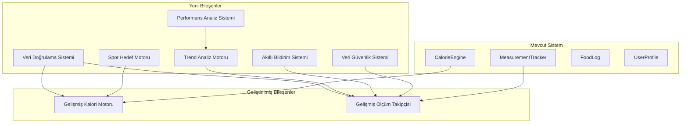

# Fitness Kalori Takip İyileştirme Tasarım Dokümanı

## Genel Bakış

Bu tasarım dokümanı, mevcut fitness uygulamasındaki kilo hesaplama sistemi ve spor yapanlara yönelik özelliklerin iyileştirilmesi için teknik çözümleri tanımlar. Sistem, backward compatibility sağlayarak mevcut altyapı üzerine inşa edilecek ve daha doğru kilo takibi, gelişmiş kalori hesaplama, spor yapanlara özel özellikler ve iyileştirilmiş kullanıcı deneyimi sunacaktır.

### Temel Hedefler

- **Doğruluk**: Kilo hesaplama sisteminin hassasiyetini artırma
- **Kişiselleştirme**: Spor yapanlara özel kalori hedefleme algoritmaları
- **Güvenilirlik**: Gelişmiş ölçüm takip sistemi ve veri doğrulama
- **Kullanıcı Deneyimi**: Akıllı bildirim sistemi ve UX iyileştirmeleri
- **Analitik**: Performans analiz ve raporlama sistemi
- **Güvenlik**: Veri güvenliği ve yedekleme mekanizmaları

## Mimari

### Mevcut Sistem Analizi

Mevcut sistem aşağıdaki temel bileşenlerden oluşmaktadır:

- **CalorieEngine**: Mifflin-St Jeor formülü ile BMR/TDEE hesaplama
- **MeasurementTracker**: Temel kilo ve ölçüm takibi
- **FoodLog**: Kalori günlüğü yönetimi
- **UserProfile**: Kullanıcı profil bilgileri

### Yeni Mimari Bileşenleri



## Bileşenler ve Arayüzler

### 1. Veri Doğrulama Sistemi (DataValidator)

**Amaç**: Girilen verilerin mantıklı aralıklarda olup olmadığını kontrol etmek

```python
class DataValidator:
    """Veri doğrulama ve tutarlılık kontrolü"""
    
    # Doğrulama aralıkları
    WEIGHT_RANGE = (30.0, 300.0)  # kg
    HEIGHT_RANGE = (100.0, 250.0)  # cm
    WAIST_RANGE = (40.0, 200.0)  # cm
    DAILY_WEIGHT_CHANGE_LIMIT = 0.5  # kg
    MEASUREMENT_CHANGE_THRESHOLD = 0.20  # %20
    
    async def validate_weight(self, weight_kg: float, user_id: int, db: AsyncSession) -> ValidationResult
    async def validate_measurement(self, measurement: MeasurementCreate) -> ValidationResult
    async def check_daily_weight_change(self, user_id: int, new_weight: float, db: AsyncSession) -> bool
    async def detect_outliers(self, measurements: List[float]) -> List[int]
```

### 2. Spor Hedef Motoru (SportTargetEngine)

**Amaç**: Spor yapanlara özel kalori hedefleme algoritmaları

```python
class SportTargetEngine:
    """Spor yapanlara özel kalori ve makro hedefleme"""
    
    # Antrenman günü kalori artışı
    TRAINING_DAY_MULTIPLIER = 1.15  # %15 artış
    REST_DAY_MULTIPLIER = 1.05     # %5 artış
    
    # Spor yapanlar için makro oranları
    ATHLETE_MACROS = {
        "muscle_gain": {"protein": 0.35, "carbs": 0.45, "fat": 0.20},
        "recomposition": {"protein": 0.40, "carbs": 0.35, "fat": 0.25},
        "endurance": {"protein": 0.25, "carbs": 0.55, "fat": 0.20}
    }
    
    async def calculate_athlete_calories(self, user_profile: UserProfile, training_day: bool) -> float
    async def get_sport_specific_macros(self, goal: str, daily_calories: float) -> MacroTargets
    async def adjust_for_training_intensity(self, base_calories: float, intensity: str) -> float
```

### 3. Gelişmiş Trend Analiz Motoru (TrendAnalysisEngine)

**Amaç**: Kilo ve ölçüm verilerindeki eğilimleri analiz etmek

```python
class TrendAnalysisEngine:
    """Gelişmiş trend analizi ve tahminleme"""
    
    async def calculate_weekly_average_change(self, user_id: int, db: AsyncSession) -> WeeklyTrend
    async def detect_weight_plateau(self, user_id: int, db: AsyncSession) -> PlateauAnalysis
    async def predict_goal_timeline(self, user_id: int, target_weight: float, db: AsyncSession) -> Timeline
    async def calculate_body_composition_estimate(self, measurements: List[Measurement]) -> BodyComposition
    async def generate_progress_insights(self, user_id: int, db: AsyncSession) -> List[Insight]
```

### 4. Akıllı Bildirim Sistemi (SmartNotificationSystem)

**Amaç**: Kullanıcıya hatırlatma ve motivasyon bildirimleri göndermek

```python
class SmartNotificationSystem:
    """Akıllı bildirim ve hatırlatma sistemi"""
    
    MAX_DAILY_NOTIFICATIONS = 2
    
    async def analyze_user_patterns(self, user_id: int, db: AsyncSession) -> UserPatterns
    async def get_optimal_reminder_time(self, user_id: int, db: AsyncSession) -> datetime
    async def generate_motivation_message(self, progress_data: ProgressData) -> str
    async def should_send_reminder(self, user_id: int, notification_type: str, db: AsyncSession) -> bool
    async def schedule_smart_reminders(self, user_id: int, db: AsyncSession) -> List[ScheduledNotification]
```

### 5. Performans Analiz Sistemi (PerformanceAnalysisSystem)

**Amaç**: Detaylı analiz raporları oluşturmak

```python
class PerformanceAnalysisSystem:
    """Performans analizi ve raporlama"""
    
    async def generate_weekly_report(self, user_id: int, db: AsyncSession) -> WeeklyReport
    async def generate_monthly_report(self, user_id: int, db: AsyncSession) -> MonthlyReport
    async def calculate_goal_achievement_rate(self, user_id: int, db: AsyncSession) -> float
    async def calculate_consistency_score(self, user_id: int, db: AsyncSession) -> ConsistencyScore
    async def generate_recommendations(self, analysis_data: AnalysisData) -> List[Recommendation]
```

### 6. Veri Güvenlik Sistemi (DataSecuritySystem)

**Amaç**: Veri güvenliği ve yedekleme mekanizmaları

```python
class DataSecuritySystem:
    """Veri güvenliği ve yedekleme"""
    
    async def encrypt_measurement_data(self, data: dict) -> str
    async def decrypt_measurement_data(self, encrypted_data: str) -> dict
    async def create_backup(self, user_id: int, db: AsyncSession) -> BackupResult
    async def export_user_data(self, user_id: int, db: AsyncSession) -> dict
    async def cleanup_old_data(self, days_threshold: int, db: AsyncSession) -> CleanupResult
    async def perform_rollback(self, user_id: int, backup_id: str, db: AsyncSession) -> bool
```

## Veri Modelleri

### Yeni Veri Modelleri

```python
class WeightValidation(Base):
    """Kilo doğrulama kayıtları"""
    __tablename__ = "weight_validations"
    
    id: Mapped[int] = mapped_column(Integer, primary_key=True)
    user_id: Mapped[int] = mapped_column(Integer, nullable=False)
    weight_kg: Mapped[float] = mapped_column(Float, nullable=False)
    previous_weight_kg: Mapped[Optional[float]] = mapped_column(Float, nullable=True)
    change_kg: Mapped[float] = mapped_column(Float, nullable=False)
    is_valid: Mapped[bool] = mapped_column(Boolean, nullable=False)
    validation_reason: Mapped[Optional[str]] = mapped_column(String, nullable=True)
    validated_at: Mapped[datetime] = mapped_column(DateTime, default=func.now())

class SportProfile(Base):
    """Spor yapan kullanıcılar için özelleştirilmiş profil"""
    __tablename__ = "sport_profiles"
    
    id: Mapped[int] = mapped_column(Integer, primary_key=True)
    user_id: Mapped[int] = mapped_column(Integer, nullable=False, unique=True)
    is_athlete: Mapped[bool] = mapped_column(Boolean, default=False)
    sport_type: Mapped[Optional[str]] = mapped_column(String, nullable=True)  # strength, endurance, mixed
    training_frequency: Mapped[int] = mapped_column(Integer, default=3)  # haftalık antrenman sayısı
    training_intensity: Mapped[str] = mapped_column(String, default="moderate")  # low, moderate, high
    rest_day_calories_adjustment: Mapped[float] = mapped_column(Float, default=1.05)
    training_day_calories_adjustment: Mapped[float] = mapped_column(Float, default=1.15)
    preferred_macro_split: Mapped[dict] = mapped_column(JSON, default=dict)
    created_at: Mapped[datetime] = mapped_column(DateTime, default=func.now())
    updated_at: Mapped[datetime] = mapped_column(DateTime, default=func.now())

class TrendAnalysis(Base):
    """Trend analizi sonuçları"""
    __tablename__ = "trend_analyses"
    
    id: Mapped[int] = mapped_column(Integer, primary_key=True)
    user_id: Mapped[int] = mapped_column(Integer, nullable=False)
    analysis_type: Mapped[str] = mapped_column(String, nullable=False)  # weekly, monthly, quarterly
    period_start: Mapped[datetime] = mapped_column(DateTime, nullable=False)
    period_end: Mapped[datetime] = mapped_column(DateTime, nullable=False)
    weight_change_kg: Mapped[Optional[float]] = mapped_column(Float, nullable=True)
    average_weekly_change: Mapped[Optional[float]] = mapped_column(Float, nullable=True)
    trend_direction: Mapped[str] = mapped_column(String, nullable=False)  # increasing, decreasing, stable
    confidence_score: Mapped[float] = mapped_column(Float, default=0.0)
    insights: Mapped[dict] = mapped_column(JSON, default=dict)
    created_at: Mapped[datetime] = mapped_column(DateTime, default=func.now())

class NotificationPreferences(Base):
    """Kullanıcı bildirim tercihleri"""
    __tablename__ = "notification_preferences"
    
    id: Mapped[int] = mapped_column(Integer, primary_key=True)
    user_id: Mapped[int] = mapped_column(Integer, nullable=False, unique=True)
    weight_reminders: Mapped[bool] = mapped_column(Boolean, default=True)
    measurement_reminders: Mapped[bool] = mapped_column(Boolean, default=True)
    motivation_messages: Mapped[bool] = mapped_column(Boolean, default=True)
    progress_reports: Mapped[bool] = mapped_column(Boolean, default=True)
    max_daily_notifications: Mapped[int] = mapped_column(Integer, default=2)
    preferred_reminder_time: Mapped[Optional[str]] = mapped_column(String, nullable=True)  # HH:MM format
    quiet_hours_start: Mapped[Optional[str]] = mapped_column(String, nullable=True)
    quiet_hours_end: Mapped[Optional[str]] = mapped_column(String, nullable=True)
    created_at: Mapped[datetime] = mapped_column(DateTime, default=func.now())
    updated_at: Mapped[datetime] = mapped_column(DateTime, default=func.now())

class DataBackup(Base):
    """Veri yedekleme kayıtları"""
    __tablename__ = "data_backups"
    
    id: Mapped[str] = mapped_column(String, primary_key=True)  # UUID
    user_id: Mapped[int] = mapped_column(Integer, nullable=False)
    backup_type: Mapped[str] = mapped_column(String, nullable=False)  # full, incremental
    data_encrypted: Mapped[str] = mapped_column(Text, nullable=False)  # Şifrelenmiş JSON
    file_size_bytes: Mapped[int] = mapped_column(Integer, nullable=False)
    checksum: Mapped[str] = mapped_column(String, nullable=False)
    created_at: Mapped[datetime] = mapped_column(DateTime, default=func.now())
    expires_at: Mapped[datetime] = mapped_column(DateTime, nullable=False)
```

### Mevcut Modellerde Genişletmeler

```python
# UserProfile modeline eklenmesi gereken alanlar
class UserProfile(Base):
    # ... mevcut alanlar ...
    
    # Yeni alanlar
    is_athlete: Mapped[bool] = mapped_column(Boolean, default=False)
    preferred_measurement_time: Mapped[Optional[str]] = mapped_column(String, nullable=True)
    data_retention_days: Mapped[int] = mapped_column(Integer, default=365)
    privacy_level: Mapped[str] = mapped_column(String, default="standard")  # minimal, standard, detailed

# Measurement modeline eklenmesi gereken alanlar
class Measurement(Base):
    # ... mevcut alanlar ...
    
    # Yeni alanlar
    is_validated: Mapped[bool] = mapped_column(Boolean, default=True)
    validation_notes: Mapped[Optional[str]] = mapped_column(String, nullable=True)
    measurement_method: Mapped[str] = mapped_column(String, default="manual")  # manual, smart_scale, estimated
    confidence_score: Mapped[float] = mapped_column(Float, default=1.0)
```

## Correctness Properties

*A property is a characteristic or behavior that should hold true across all valid executions of a system-essentially, a formal statement about what the system should do. Properties serve as the bridge between human-readable specifications and machine-verifiable correctness guarantees.*

### Property 1: Kilo Doğrulama Aralık Kontrolü

*For any* kilo değeri, veri doğrulayıcısı 30-300 kg aralığındaki değerleri kabul etmeli ve bu aralık dışındaki değerleri reddetmelidir.

**Validates: Requirements 1.1, 1.2**

### Property 2: BMR Hesaplama Doğruluğu

*For any* geçerli kullanıcı parametreleri (kilo, boy, yaş, cinsiyet), kalori motoru Mifflin-St Jeor formülüne göre doğru BMR değeri hesaplamalıdır.

**Validates: Requirements 1.3**

### Property 3: Haftalık Trend Hesaplama

*For any* kilo ölçüm serisi, trend analizörü haftalık ortalama kilo değişimini matematiksel olarak doğru hesaplamalıdır.

**Validates: Requirements 1.4**

### Property 4: Günlük Kilo Değişim Limiti

*For any* günlük kilo değişimi, sistem 0.5 kg'ı aşan değişimler için uyarı vermeli ve aşmayan değişimler için uyarı vermemelidir.

**Validates: Requirements 1.5**

### Property 5: Spor Yapanlar İçin Kalori Artışı

*For any* spor profili aktif olan kullanıcı, hedef hesaplayıcısı antrenman günleri için %10-15 aralığında kalori artışı sağlamalıdır.

**Validates: Requirements 2.1**

### Property 6: Dinlenme Günü Kalori Hedefi

*For any* kullanıcı profili, dinlenme günü kalori hedefi BMR'ye yakın değerde olmalıdır.

**Validates: Requirements 2.2**

### Property 7: Kas Kazanma Protein Oranı

*For any* kas kazanma hedefi olan kullanıcı, sistem protein oranını %35-40 arasında ayarlamalıdır.

**Validates: Requirements 2.3**

### Property 8: Yoğun Antrenman Karbonhidrat Oranı

*For any* yoğun antrenman yapan kullanıcı, sistem karbonhidrat oranını %45-50 arasında artırmalıdır.

**Validates: Requirements 2.4**

### Property 9: Vücut Rekomposizyonu Kalori Açığı

*For any* vücut rekomposizyonu hedefi olan kullanıcı, hedef hesaplayıcısı TDEE'den 250 kalori az hedef önermelidir.

**Validates: Requirements 2.5**

### Property 10: Ölçüm Kaydetme Bütünlüğü

*For any* geçerli ölçüm kombinasyonu, ölçüm takipçisi tüm ölçüm tiplerini (kilo, bel, kalça, göğüs, kol, bacak) doğru şekilde kaydetmelidir.

**Validates: Requirements 3.1**

### Property 11: Ölçüm Doğrulama Aralıkları

*For any* ölçüm değeri, veri doğrulayıcısı her ölçüm tipi için mantıklı aralıkları kontrol etmeli ve geçersiz değerleri reddetmelidir.

**Validates: Requirements 3.2**

### Property 12: Aykırı Değer Tespiti

*For any* ölçüm değişimi, sistem %20'den fazla değişimler için uyarı vermeli ve daha küçük değişimler için uyarı vermemelidir.

**Validates: Requirements 3.4**

### Property 13: Bildirim Zamanlama

*For any* kullanıcı ölçüm geçmişi, bildirim sistemi 3 günden fazla ölçüm yapılmayan durumlar için hatırlatma bildirimi göndermelidir.

**Validates: Requirements 4.1**

### Property 14: Hedef Başarım Kontrolü

*For any* haftalık başarım oranı, sistem %80'in altındaki oranlar için motivasyon mesajı göndermeli ve üstündeki oranlar için göndermemelidir.

**Validates: Requirements 4.3**

### Property 15: Günlük Bildirim Sınırı

*For any* bildirim talebi, bildirim sistemi günlük bildirim sayısını maksimum 2 ile sınırlamalıdır.

**Validates: Requirements 4.4**

### Property 16: Veri Şifreleme Round-Trip

*For any* ölçüm verisi, şifreleme ve şifre çözme işlemleri orijinal veriyi korumalıdır (round-trip property).

**Validates: Requirements 6.1**

### Property 17: JSON Dışa Aktarım Formatı

*For any* kullanıcı veri seti, JSON dışa aktarımı geçerli JSON formatında olmalı ve tüm veri alanlarını içermelidir.

**Validates: Requirements 6.3**

### Property 18: Veri Temizleme Yaş Kontrolü

*For any* geçici veri, sistem 30 günden eski verileri temizlemeli ve daha yeni verileri korumalıdır.

**Validates: Requirements 6.5**

### Property 19: Performans Sınırı

*For any* ölçüm girişi, sistem işlemi 3 saniye içinde tamamlamalıdır.

**Validates: Requirements 7.2**

### Property 20: Kalori Hesaplama Hassasiyeti

*For any* besin değeri, kalori motoru hesaplamaları 0.1 kalori hassasiyetle yapmalıdır.

**Validates: Requirements 8.1**

### Property 21: Makro Kalori Katsayıları

*For any* makro besin değeri, sistem protein ve karbonhidrat için 4 kal/g, yağ için 9 kal/g katsayılarını kullanmalıdır.

**Validates: Requirements 8.2**

### Property 22: Çift Hassasiyet Yuvarlama

*For any* karmaşık kalori hesaplaması, kalori motoru çift hassasiyet kullanarak yuvarlama hatalarını minimize etmelidir.

**Validates: Requirements 8.5**

## Hata Yönetimi

### Veri Doğrulama Hataları

```python
class ValidationError(Exception):
    """Veri doğrulama hatası"""
    def __init__(self, field: str, value: any, reason: str):
        self.field = field
        self.value = value
        self.reason = reason
        super().__init__(f"Validation failed for {field}: {reason}")

class WeightValidationError(ValidationError):
    """Kilo doğrulama hatası"""
    pass

class MeasurementValidationError(ValidationError):
    """Ölçüm doğrulama hatası"""
    pass
```

### Sistem Hataları

```python
class SystemError(Exception):
    """Sistem hatası"""
    pass

class CalculationError(SystemError):
    """Hesaplama hatası"""
    pass

class BackupError(SystemError):
    """Yedekleme hatası"""
    pass

class EncryptionError(SystemError):
    """Şifreleme hatası"""
    pass
```

### Hata Yönetimi Stratejileri

1. **Graceful Degradation**: Kritik olmayan özellikler başarısız olursa sistem çalışmaya devam eder
2. **Retry Mechanism**: Geçici hatalar için otomatik yeniden deneme
3. **Fallback Values**: Hesaplama hataları durumunda güvenli varsayılan değerler
4. **User Feedback**: Kullanıcı dostu hata mesajları ve çözüm önerileri
5. **Logging**: Detaylı hata kayıtları ve izleme

## Test Stratejisi

### Property-Based Testing

Bu özellik için property-based testing uygun çünkü:
- Çok sayıda matematiksel hesaplama fonksiyonu içeriyor
- Veri doğrulama ve aralık kontrolleri var
- Round-trip özellikleri (şifreleme/şifre çözme) mevcut
- Farklı kullanıcı profilleri ve veri kombinasyonları test edilebilir

**Test Konfigürasyonu:**
- Minimum 100 iterasyon per property test
- Python için Hypothesis kütüphanesi kullanılacak
- Her property test design dokümanındaki property'ye referans verecek
- Tag format: **Feature: fitness-kalori-takip-iyilestirme, Property {number}: {property_text}**

### Unit Testing

**Odak Alanları:**
- Spesifik edge case'ler (sınır değerler)
- Hata durumları ve exception handling
- Integration noktaları
- UI bileşenleri için snapshot testler

**Test Kategorileri:**
1. **Validation Tests**: Veri doğrulama fonksiyonları
2. **Calculation Tests**: Matematiksel hesaplama fonksiyonları
3. **Integration Tests**: Veritabanı ve external service entegrasyonları
4. **Performance Tests**: Yanıt süresi ve throughput testleri
5. **Security Tests**: Şifreleme ve veri güvenliği testleri

### Integration Testing

**Test Senaryoları:**
- End-to-end kullanıcı akışları
- Veritabanı işlemleri
- Bildirim sistemi entegrasyonu
- Backup ve recovery işlemleri
- API endpoint testleri

### Performance Testing

**Metrikler:**
- Ölçüm girişi: < 3 saniye
- Trend analizi: < 5 saniye
- Rapor oluşturma: < 10 saniye
- Veri dışa aktarım: < 30 saniye

## Güvenlik Konuları

### Veri Koruma

1. **Encryption at Rest**: Tüm ölçüm verileri AES-256 ile şifrelenir
2. **Encryption in Transit**: HTTPS/TLS 1.3 kullanımı
3. **Data Anonymization**: Raporlarda kişisel tanımlayıcılar maskelenir
4. **Access Control**: Role-based erişim kontrolü

### Privacy

1. **Data Minimization**: Sadece gerekli veriler toplanır
2. **Retention Policy**: Veriler belirli süre sonra otomatik silinir
3. **User Consent**: Veri işleme için açık kullanıcı onayı
4. **Right to Deletion**: Kullanıcı verilerini silme hakkı

### Audit ve Monitoring

1. **Audit Logs**: Tüm veri erişimleri loglanır
2. **Anomaly Detection**: Anormal veri erişim kalıpları tespit edilir
3. **Security Alerts**: Güvenlik ihlalleri için otomatik uyarılar
4. **Regular Security Reviews**: Düzenli güvenlik değerlendirmeleri

## Performans Optimizasyonları

### Veritabanı Optimizasyonları

1. **Indexing Strategy**: Sık sorgulanan alanlar için indexler
2. **Query Optimization**: N+1 problemlerinin önlenmesi
3. **Connection Pooling**: Veritabanı bağlantı havuzu
4. **Caching**: Redis ile sık erişilen verilerin cache'lenmesi

### Hesaplama Optimizasyonları

1. **Lazy Loading**: İhtiyaç duyulduğunda hesaplama
2. **Memoization**: Pahalı hesaplamaların cache'lenmesi
3. **Batch Processing**: Toplu işlemler için optimize edilmiş algoritmalar
4. **Parallel Processing**: CPU-intensive işlemler için paralel hesaplama

### Frontend Optimizasyonları

1. **Code Splitting**: Lazy loading ile bundle boyutu optimizasyonu
2. **Virtual Scrolling**: Büyük veri listeleri için
3. **Debouncing**: Kullanıcı girişlerinde gereksiz API çağrılarının önlenmesi
4. **Progressive Loading**: Aşamalı veri yükleme

## Deployment ve DevOps

### CI/CD Pipeline

1. **Automated Testing**: Her commit'te otomatik test çalıştırma
2. **Code Quality Gates**: SonarQube ile kod kalitesi kontrolü
3. **Security Scanning**: Güvenlik açıklarının otomatik tespiti
4. **Performance Testing**: Automated performance regression tests

### Monitoring ve Alerting

1. **Application Metrics**: Response time, error rate, throughput
2. **Business Metrics**: Kullanıcı aktivitesi, feature adoption
3. **Infrastructure Metrics**: CPU, memory, disk usage
4. **Custom Alerts**: Business-specific uyarılar

### Backup ve Recovery

1. **Automated Backups**: Günlük otomatik yedeklemeler
2. **Point-in-Time Recovery**: Belirli zamana geri dönüş
3. **Cross-Region Replication**: Coğrafi olarak dağıtılmış yedekler
4. **Disaster Recovery Plan**: Felaket durumu kurtarma planı

## Backward Compatibility

### Veri Migrasyonu

1. **Schema Evolution**: Mevcut veritabanı şemasının aşamalı güncellenmesi
2. **Data Transformation**: Eski veri formatlarının yeni formatlara dönüştürülmesi
3. **Rollback Strategy**: Geri alma planları
4. **Zero-Downtime Migration**: Kesintisiz veri migrasyonu

### API Compatibility

1. **Versioning Strategy**: API versiyonlama stratejisi
2. **Deprecation Policy**: Eski API'ların kaldırılma politikası
3. **Backward Compatible Changes**: Geriye uyumlu değişiklikler
4. **Migration Guides**: Geliştiriciler için migration kılavuzları

### Feature Flags

1. **Gradual Rollout**: Yeni özelliklerin aşamalı açılması
2. **A/B Testing**: Özellik performansının test edilmesi
3. **Quick Rollback**: Hızlı geri alma imkanı
4. **User Segmentation**: Kullanıcı gruplarına özel özellik açma

Bu tasarım dokümanı, mevcut fitness uygulamasının kilo hesaplama sistemi ve spor yapanlara yönelik özelliklerinin iyileştirilmesi için kapsamlı bir teknik çözüm sunmaktadır. Backward compatibility sağlanarak, sistem güvenilirliği ve kullanıcı deneyimi önemli ölçüde artırılacaktır.