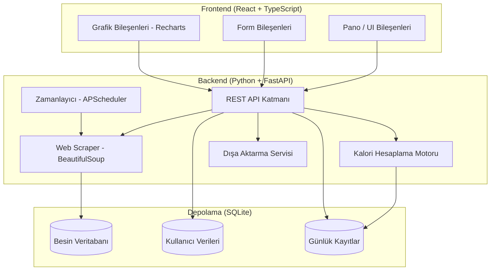

# Tasarım Dokümanı: Fitness ve Kalori Takip Uygulaması

## Genel Bakış

Bu doküman, kullanıcıların günlük kalori alımını takip etmesini, antrenman programlarını yönetmesini, kreatin kullanımını izlemesini ve kilo/vücut ölçümlerini kaydetmesini sağlayan bir masaüstü/web uygulamasının teknik tasarımını tanımlamaktadır.

Uygulama, diyetkolik.com'dan besin kalori verilerini çekerek yerel bir veritabanı oluşturur ve kullanıcıya kapsamlı bir fitness panosu sunar. Tüm veriler yerel olarak saklanır; internet bağlantısı yalnızca web scraping için gereklidir.

### Temel Tasarım Kararları

- **Yerel-önce mimari**: Tüm kullanıcı verileri cihazda saklanır, gizlilik korunur.
- **SQLite veritabanı**: Hafif, kurulum gerektirmeyen, güvenilir yerel depolama.
- **Python + FastAPI backend**: Web scraping, hesaplama motoru ve API katmanı için.
- **React + TypeScript frontend**: Etkileşimli pano ve form bileşenleri için.
- **Recharts**: Grafik ve görselleştirme kütüphanesi.
- **APScheduler**: Otomatik web scraping zamanlaması için.

---

## Mimari

Uygulama üç katmanlı bir mimariye sahiptir:



### Bileşen Sorumlulukları

| Bileşen | Sorumluluk |
|---|---|
| Web Scraper | diyetkolik.com'dan besin verisi çekme ve ayrıştırma |
| Kalori Hesaplama Motoru | BMR/TDEE hesaplama, makro hesaplama, günlük toplam |
| Spor Takipçi | Antrenman programı CRUD, geçmiş kayıt |
| Kreatin Takipçi | Faz yönetimi, doz kayıt |
| Ölçüm Kayıt | Kilo/ölçüm CRUD, trend hesaplama |
| Pano Servisi | Tüm bileşenlerden veri toplayıp birleştirme |
| Dışa Aktarma Servisi | CSV üretimi ve round-trip doğrulama |

---

## Bileşenler ve Arayüzler

### 1. Web Scraper Bileşeni

```
ScraperService
  ├── scrape_all()           → List[FoodItem]
  ├── scrape_page(url)       → List[FoodItem]
  ├── parse_food_item(html)  → FoodItem
  ├── save_to_db(items)      → ScrapeResult
  └── get_last_scrape_info() → ScrapeMetadata
```

**Hedef URL**: `https://www.diyetkolik.com/kac-kalori/kategori/et-tavuk-balik`

Sayfalama varsa tüm sayfalar dolaşılır. Her besin öğesi için HTML'den ad, kalori/100g, protein, karbonhidrat ve yağ değerleri ayrıştırılır.

### 2. Kalori Hesaplama Motoru

```
CalorieEngine
  ├── calculate_bmr(profile: UserProfile) → float
  ├── calculate_tdee(bmr, activity_level) → float
  ├── calculate_macros(food_item, grams)  → MacroResult
  ├── get_daily_total(user_id, date)      → DailySummary
  ├── add_food_log(entry: FoodLogEntry)   → FoodLogEntry
  └── delete_food_log(entry_id)          → DailySummary
```

BMR hesaplama için **Mifflin-St Jeor** denklemi kullanılır:
- Erkek: `BMR = 10 × kilo + 6.25 × boy − 5 × yaş + 5`
- Kadın: `BMR = 10 × kilo + 6.25 × boy − 5 × yaş − 161`

TDEE = BMR × aktivite_katsayısı (1.2 – 1.9 arası)

### 3. Spor Takipçi

```
WorkoutTracker
  ├── create_program(program: WorkoutProgram) → WorkoutProgram
  ├── list_programs()                         → List[WorkoutProgram]
  ├── log_workout(log: WorkoutLog)            → WorkoutLog
  ├── get_history(weeks=12)                   → List[WorkoutLog]
  ├── get_exercise_progress(exercise_name)    → List[ProgressPoint]
  └── get_weekly_stats(week_offset=0)         → WeeklyStats
```

### 4. Kreatin Takipçi

```
CreatineTracker
  ├── log_dose(dose: CreatineDose)       → CreatineDose
  ├── get_current_phase()                → PhaseInfo
  ├── get_history(days=30)               → List[CreatineDose]
  ├── check_phase_transition()           → Optional[Notification]
  └── get_today_status()                 → TodayCreatineStatus
```

Faz geçiş mantığı: Yükleme fazında 7 gün geçince otomatik idame fazına geçiş bildirimi üretilir.

### 5. Ölçüm Kayıt

```
MeasurementTracker
  ├── add_measurement(m: Measurement)    → Measurement
  ├── get_history()                      → List[Measurement]
  ├── get_trend(days=30)                 → TrendData
  └── get_delta()                        → MeasurementDelta
```

### 6. Pano Servisi

```
DashboardService
  ├── get_dashboard_data(user_id) → DashboardSnapshot
```

`DashboardSnapshot` tek bir API çağrısıyla tüm pano verilerini döndürür; frontend'in birden fazla istek yapmasına gerek kalmaz.

### 7. REST API Uç Noktaları

```
GET  /api/foods/search?q={term}
POST /api/foods/scrape

GET  /api/log/{date}
POST /api/log
DELETE /api/log/{entry_id}

GET  /api/profile
PUT  /api/profile

GET  /api/workouts/programs
POST /api/workouts/programs
POST /api/workouts/log
GET  /api/workouts/history
GET  /api/workouts/progress/{exercise}

GET  /api/creatine/status
POST /api/creatine/log
GET  /api/creatine/history

GET  /api/measurements
POST /api/measurements
GET  /api/measurements/trend

GET  /api/dashboard

GET  /api/export?type={calories|workouts|measurements}&from={date}&to={date}
```

---

## Veri Modelleri

### FoodItem (Besin Öğesi)

```python
@dataclass
class FoodItem:
    id: int
    name: str                  # Besin adı
    calories_per_100g: float   # 100g başına kalori
    protein_per_100g: float    # 100g başına protein (g)
    carbs_per_100g: float      # 100g başına karbonhidrat (g)
    fat_per_100g: float        # 100g başına yağ (g)
    source_url: str            # Kaynak URL
    scraped_at: datetime       # Çekilme zamanı
```

### UserProfile (Kullanıcı Profili)

```python
@dataclass
class UserProfile:
    id: int
    weight_kg: float
    height_cm: float
    age: int
    gender: str                # "male" | "female"
    activity_level: str        # "sedentary" | "light" | "moderate" | "active" | "very_active"
    goal: str                  # "lose" | "maintain" | "gain"
    weekly_workout_goal: int   # Haftada kaç gün antrenman hedefi
    daily_calorie_target: Optional[float]  # Manuel override
    updated_at: datetime
```

### FoodLogEntry (Kalori Günlüğü Girişi)

```python
@dataclass
class FoodLogEntry:
    id: int
    user_id: int
    food_item_id: int
    food_name: str             # Denormalize — besin silinse bile kayıt kalır
    grams: float
    calories: float            # Hesaplanmış değer
    protein: float
    carbs: float
    fat: float
    logged_at: datetime
    meal_type: str             # "breakfast" | "lunch" | "dinner" | "snack"
```

### WorkoutProgram (Antrenman Programı)

```python
@dataclass
class WorkoutProgram:
    id: int
    name: str                  # "Pazartesi - Üst Vücut"
    exercises: List[Exercise]
    created_at: datetime

@dataclass
class Exercise:
    id: int
    program_id: int
    name: str                  # "Bench Press"
    sets: int
    reps: int
    weight_kg: float
    order: int
```

### WorkoutLog (Antrenman Kaydı)

```python
@dataclass
class WorkoutLog:
    id: int
    program_id: int
    program_name: str          # Denormalize
    completed_at: datetime
    duration_minutes: int
    exercises_performed: List[ExerciseLog]

@dataclass
class ExerciseLog:
    id: int
    workout_log_id: int
    exercise_name: str
    sets_performed: int
    reps_performed: int
    weight_kg: float
```

### CreatineDose (Kreatin Dozu)

```python
@dataclass
class CreatineDose:
    id: int
    user_id: int
    dose_grams: float
    phase: str                 # "loading" | "maintenance"
    taken_at: datetime
```

### Measurement (Ölçüm)

```python
@dataclass
class Measurement:
    id: int
    user_id: int
    weight_kg: Optional[float]
    waist_cm: Optional[float]
    hip_cm: Optional[float]
    chest_cm: Optional[float]
    arm_cm: Optional[float]
    leg_cm: Optional[float]
    measured_at: datetime
```

### ScrapeMetadata (Scraping Meta Verisi)

```python
@dataclass
class ScrapeMetadata:
    last_scrape_at: datetime
    food_count: int
    status: str                # "success" | "failed"
    error_message: Optional[str]
```

### SQLite Şema Özeti

```sql
CREATE TABLE food_items (
    id INTEGER PRIMARY KEY,
    name TEXT NOT NULL,
    calories_per_100g REAL NOT NULL,
    protein_per_100g REAL NOT NULL,
    carbs_per_100g REAL NOT NULL,
    fat_per_100g REAL NOT NULL,
    source_url TEXT,
    scraped_at TEXT NOT NULL
);

CREATE TABLE food_log (
    id INTEGER PRIMARY KEY,
    user_id INTEGER NOT NULL,
    food_item_id INTEGER,
    food_name TEXT NOT NULL,
    grams REAL NOT NULL,
    calories REAL NOT NULL,
    protein REAL NOT NULL,
    carbs REAL NOT NULL,
    fat REAL NOT NULL,
    logged_at TEXT NOT NULL,
    meal_type TEXT NOT NULL
);

CREATE TABLE workout_programs (
    id INTEGER PRIMARY KEY,
    name TEXT NOT NULL,
    created_at TEXT NOT NULL
);

CREATE TABLE exercises (
    id INTEGER PRIMARY KEY,
    program_id INTEGER NOT NULL,
    name TEXT NOT NULL,
    sets INTEGER NOT NULL,
    reps INTEGER NOT NULL,
    weight_kg REAL NOT NULL,
    "order" INTEGER NOT NULL,
    FOREIGN KEY (program_id) REFERENCES workout_programs(id)
);

CREATE TABLE workout_logs (
    id INTEGER PRIMARY KEY,
    program_id INTEGER,
    program_name TEXT NOT NULL,
    completed_at TEXT NOT NULL,
    duration_minutes INTEGER NOT NULL
);

CREATE TABLE exercise_logs (
    id INTEGER PRIMARY KEY,
    workout_log_id INTEGER NOT NULL,
    exercise_name TEXT NOT NULL,
    sets_performed INTEGER NOT NULL,
    reps_performed INTEGER NOT NULL,
    weight_kg REAL NOT NULL,
    FOREIGN KEY (workout_log_id) REFERENCES workout_logs(id)
);

CREATE TABLE creatine_doses (
    id INTEGER PRIMARY KEY,
    user_id INTEGER NOT NULL,
    dose_grams REAL NOT NULL,
    phase TEXT NOT NULL,
    taken_at TEXT NOT NULL
);

CREATE TABLE measurements (
    id INTEGER PRIMARY KEY,
    user_id INTEGER NOT NULL,
    weight_kg REAL,
    waist_cm REAL,
    hip_cm REAL,
    chest_cm REAL,
    arm_cm REAL,
    leg_cm REAL,
    measured_at TEXT NOT NULL
);

CREATE TABLE user_profile (
    id INTEGER PRIMARY KEY,
    weight_kg REAL NOT NULL,
    height_cm REAL NOT NULL,
    age INTEGER NOT NULL,
    gender TEXT NOT NULL,
    activity_level TEXT NOT NULL,
    goal TEXT NOT NULL,
    weekly_workout_goal INTEGER NOT NULL DEFAULT 4,
    daily_calorie_target REAL,
    updated_at TEXT NOT NULL
);

CREATE TABLE scrape_metadata (
    id INTEGER PRIMARY KEY,
    last_scrape_at TEXT NOT NULL,
    food_count INTEGER NOT NULL,
    status TEXT NOT NULL,
    error_message TEXT
);

CREATE VIRTUAL TABLE food_search USING fts5(name, content=food_items, content_rowid=id);
```

> `food_search` FTS5 sanal tablosu, besin adı aramasını 300ms altında tutmak için kullanılır.


---

## Doğruluk Özellikleri (Correctness Properties)

*Bir özellik (property), bir sistemin tüm geçerli çalışmalarında doğru olması gereken bir karakteristik veya davranıştır — temelde sistemin ne yapması gerektiğine dair biçimsel bir ifadedir. Özellikler, insan tarafından okunabilir spesifikasyonlar ile makine tarafından doğrulanabilir doğruluk garantileri arasında köprü görevi görür.*

Bu özellik için property-based testing uygundur çünkü:
- Kalori hesaplama, BMR/TDEE hesaplama ve makro hesaplama **saf fonksiyonlardır**
- Besin verisi serileştirme ve CSV round-trip **evrensel özellikler** içerir
- Girdi uzayı geniştir (farklı profiller, farklı besinler, farklı gram değerleri)
- Testler in-memory çalışabilir, dış servis gerektirmez

**Kullanılacak kütüphane**: Python için `hypothesis`

---

### Özellik 1: Besin Verisi Serileştirme Round-Trip

*Her türlü* geçerli `FoodItem` nesnesi için, nesneyi JSON'a serileştirip tekrar deserileştirmek, orijinal nesneyle eşdeğer bir nesne üretmelidir.

**Doğrular: Gereksinim 1.8, 1.3**

---

### Özellik 2: Gram Bazlı Makro Hesaplama Orantısallığı

*Her türlü* geçerli `FoodItem` ve pozitif `grams` değeri için, hesaplanan kalori değeri `calories_per_100g * grams / 100` formülüne eşit olmalıdır. Aynı orantısallık protein, karbonhidrat ve yağ için de geçerlidir.

**Doğrular: Gereksinim 2.2**

---

### Özellik 3: Kalori Günlüğü Toplam Invariantı

*Her türlü* `FoodLogEntry` listesi için, günlük toplam kalori değeri tüm girişlerin kalori değerlerinin toplamına eşit olmalıdır. Bir giriş silindiğinde toplam, silinen girişin kalorisi kadar azalmalıdır.

**Doğrular: Gereksinim 2.3, 2.4**

---

### Özellik 4: BMR Pozitiflik ve Cinsiyet Farkı Invariantı

*Her türlü* geçerli `UserProfile` (pozitif boy, kilo, yaş) için:
- Hesaplanan BMR değeri her zaman pozitif olmalıdır
- Aynı profil için erkek BMR değeri kadın BMR değerinden 166 kalori fazla olmalıdır (Mifflin-St Jeor sabiti)
- TDEE her zaman BMR'den büyük olmalıdır

**Doğrular: Gereksinim 3.1**

---

### Özellik 5: Hedef Bazlı Kalori Önerisi Yönü

*Her türlü* geçerli `UserProfile` için:
- `goal = "lose"` ise önerilen günlük kalori hedefi TDEE'den düşük olmalıdır
- `goal = "gain"` ise önerilen günlük kalori hedefi TDEE'den yüksek olmalıdır
- `goal = "maintain"` ise önerilen günlük kalori hedefi TDEE'ye eşit olmalıdır

**Doğrular: Gereksinim 3.2**

---

### Özellik 6: Makro Kalori Toplamı Tutarlılığı

*Her türlü* günlük kalori hedefi için hesaplanan makro hedefleri (protein_g, carbs_g, fat_g), `protein_g * 4 + carbs_g * 4 + fat_g * 9` formülüyle hesaplanan toplam kaloriye yakın (±5 kalori tolerans) olmalıdır.

**Doğrular: Gereksinim 3.3, 3.6**

---

### Özellik 7: Tarih Bazlı Günlük Filtreleme Doğruluğu

*Her türlü* tarih ve `FoodLogEntry` koleksiyonu için, belirli bir tarih için sorgulama yapıldığında döndürülen tüm girişlerin `logged_at` tarihi sorgu tarihiyle eşleşmeli; o tarihe ait hiçbir giriş atlanmamalıdır.

**Doğrular: Gereksinim 2.6**

---

### Özellik 8: CSV Dışa Aktarma Round-Trip

*Her türlü* geçerli veri kaydı koleksiyonu (kalori günlüğü, ölçüm geçmişi veya antrenman geçmişi) için, veriyi CSV'ye dışa aktarıp tekrar içe aktarmak orijinal veriyle eşdeğer bir koleksiyon üretmelidir.

**Doğrular: Gereksinim 8.3**

---

## Hata Yönetimi

### Web Scraping Hataları

| Hata Durumu | Davranış |
|---|---|
| HTTP 4xx/5xx | Hata loglanır, yerel DB kullanılmaya devam edilir |
| Ağ bağlantısı yok | Yerel DB kullanılır, kullanıcıya bilgi verilir |
| HTML yapısı değişmiş | Ayrıştırma hatası loglanır, kısmi veri kaydedilir |
| Boş yanıt | Mevcut DB korunur, metadata güncellenmez |

### Hesaplama Hataları

| Hata Durumu | Davranış |
|---|---|
| Sıfır veya negatif gram | `ValueError` fırlatılır, API 400 döner |
| Eksik profil verisi | BMR/TDEE hesaplanamaz, kullanıcıya profil tamamlama istenir |
| Geçersiz aktivite seviyesi | Varsayılan "sedentary" kullanılır |

### Veri Bütünlüğü

- Tüm veritabanı yazma işlemleri transaction içinde yapılır
- Uygulama kapanmadan önce SQLite WAL modu etkinleştirilir
- Dışa aktarma başarısız olursa geçici dosya silinir, kullanıcıya hata mesajı gösterilir

---

## Test Stratejisi

### Çift Katmanlı Test Yaklaşımı

**Birim Testleri** (pytest):
- Kalori hesaplama fonksiyonları için somut örnekler
- Hata durumları (sıfır gram, eksik profil, HTTP hatası)
- Faz geçiş mantığı (kreatin yükleme → idame)
- Bildirim tetikleme koşulları (3 gün antrenman yok, 7 gün kilo kaydı yok)

**Property-Based Testler** (hypothesis, minimum 100 iterasyon):

Her property testi aşağıdaki etiket formatıyla işaretlenmelidir:
```python
# Feature: fitness-kalori-takip, Property {N}: {property_text}
```

| Property | Test Açıklaması | Hypothesis Stratejisi |
|---|---|---|
| Özellik 1 | FoodItem JSON round-trip | `st.builds(FoodItem, ...)` |
| Özellik 2 | Gram bazlı makro orantısallığı | `st.floats(min_value=1, max_value=5000)` |
| Özellik 3 | Kalori günlüğü toplam invariantı | `st.lists(st.builds(FoodLogEntry, ...))` |
| Özellik 4 | BMR pozitiflik ve cinsiyet farkı | `st.builds(UserProfile, ...)` |
| Özellik 5 | Hedef bazlı kalori yönü | `st.sampled_from(["lose","maintain","gain"])` |
| Özellik 6 | Makro kalori toplamı tutarlılığı | `st.floats(min_value=1200, max_value=5000)` |
| Özellik 7 | Tarih bazlı filtreleme doğruluğu | `st.dates()`, `st.lists(...)` |
| Özellik 8 | CSV dışa aktarma round-trip | `st.lists(st.builds(...), min_size=1)` |

**Entegrasyon Testleri**:
- Gerçek SQLite DB ile scraper kayıt testi
- FTS5 arama performans testi (300ms eşiği)
- Pano API yanıt süresi testi (1 saniye eşiği)
- Scheduler konfigürasyon doğrulama (24 saatlik interval)

**Smoke Testleri**:
- Uygulama başlangıcında DB şeması doğrulama
- Scheduler'ın doğru interval ile konfigüre edildiğini doğrulama

### Test Konfigürasyonu

```python
# conftest.py
from hypothesis import settings

settings.register_profile("ci", max_examples=100)
settings.register_profile("dev", max_examples=50)
settings.load_profile("ci")
```

### Frontend Testleri (React Testing Library + Vitest)

- Pano bileşeni snapshot testleri
- Form doğrulama örnek testleri
- Grafik bileşeni render testleri
- API mock ile entegrasyon testleri
