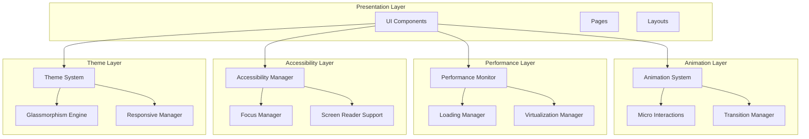

# Kullanıcı Deneyimi İyileştirmeleri - Teknik Tasarım Belgesi

## Giriş

Bu belge, fitness uygulamasının kullanıcı deneyimini dünya standartlarına çıkarmak için gerekli teknik tasarımı tanımlar. Mevcut React + TypeScript + Tailwind CSS stack'i üzerinde, MyFitnessPal ve Cronometer seviyesinde bir UX deneyimi oluşturmak için kapsamlı bir animasyon sistemi, gelişmiş UI bileşenleri ve performans optimizasyonları tasarlanmıştır.

## Genel Bakış

### Mevcut Durum
- React + TypeScript + Tailwind CSS stack
- Temel glassmorphism tasarımı
- CommunitySection.tsx (4 tab'lı topluluk sistemi)
- AIAssistant.tsx (chat arayüzü)
- Temel UI bileşenleri: GlassCard, Button, Input
- Basit animasyonlar ve geçişler

### Hedef Durum
- 60 FPS akıcı animasyon sistemi
- Gelişmiş mikro-etkileşimler
- Akıllı performans optimizasyonu
- Tam erişilebilirlik desteği
- Premium glassmorphism deneyimi
- Mobil-öncelikli responsive tasarım

## Mimari

### Sistem Mimarisi



### Katmanlı Mimari

1. **Presentation Layer**: UI bileşenleri ve sayfalar
2. **Animation Layer**: Animasyon sistemi ve mikro-etkileşimler
3. **Performance Layer**: Performans izleme ve optimizasyon
4. **Accessibility Layer**: Erişilebilirlik özellikleri
5. **Theme Layer**: Tema ve görsel sistem yönetimi

## Bileşenler ve Arayüzler

### 1. Gelişmiş Animasyon Sistemi

#### AnimationSystem Interface
```typescript
interface AnimationSystem {
  // Temel animasyon yönetimi
  registerAnimation(element: HTMLElement, config: AnimationConfig): string
  unregisterAnimation(animationId: string): void
  pauseAnimation(animationId: string): void
  resumeAnimation(animationId: string): void
  
  // Performans yönetimi
  setPerformanceMode(mode: 'high' | 'medium' | 'low'): void
  enableReducedMotion(enabled: boolean): void
  
  // Batch animasyon yönetimi
  batchAnimations(animations: AnimationConfig[]): Promise<void>
  
  // Akıllı animasyon yönetimi
  adaptToUserActivity(activityLevel: 'high' | 'medium' | 'low'): void
}

interface AnimationConfig {
  type: 'fade' | 'slide' | 'scale' | 'rotate' | 'bounce' | 'pulse' | 'shake'
  duration: number
  delay?: number
  easing: 'ease' | 'ease-in' | 'ease-out' | 'ease-in-out' | 'cubic-bezier'
  direction?: 'normal' | 'reverse' | 'alternate'
  iterations?: number | 'infinite'
  fillMode?: 'none' | 'forwards' | 'backwards' | 'both'
  
  // Performans optimizasyonları
  useGPU?: boolean
  willChange?: string[]
  
  // Koşullu animasyon
  condition?: () => boolean
  onComplete?: () => void
  onStart?: () => void
}
```

#### AnimationProvider Bileşeni
```typescript
interface AnimationProviderProps {
  children: React.ReactNode
  performanceMode?: 'auto' | 'high' | 'medium' | 'low'
  respectReducedMotion?: boolean
}

const AnimationProvider: React.FC<AnimationProviderProps>
```

### 2. Mikro-Etkileşim Sistemi

#### MicroInteraction Interface
```typescript
interface MicroInteractionSystem {
  // Temel etkileşimler
  showSuccess(element: HTMLElement, message?: string): void
  showError(element: HTMLElement, message?: string): void
  showLoading(element: HTMLElement): void
  hideLoading(element: HTMLElement): void
  
  // Form etkileşimleri
  highlightField(element: HTMLInputElement, type: 'focus' | 'error' | 'success'): void
  showFieldValidation(element: HTMLInputElement, isValid: boolean, message?: string): void
  
  // Liste etkileşimleri
  animateListAdd(element: HTMLElement, index: number): void
  animateListRemove(element: HTMLElement, index: number): void
  animateListReorder(elements: HTMLElement[], newOrder: number[]): void
  
  // Buton etkileşimleri
  animateButtonPress(element: HTMLButtonElement): void
  animateButtonHover(element: HTMLButtonElement, isHovering: boolean): void
}
```

#### useMicroInteraction Hook
```typescript
interface UseMicroInteractionReturn {
  triggerSuccess: (message?: string) => void
  triggerError: (message?: string) => void
  triggerLoading: () => void
  stopLoading: () => void
  isAnimating: boolean
}

const useMicroInteraction: (elementRef: RefObject<HTMLElement>) => UseMicroInteractionReturn
```

### 3. Gelişmiş Glassmorphism Motoru

#### GlassmorphismEngine Interface
```typescript
interface GlassmorphismEngine {
  // Dinamik blur yönetimi
  calculateBlur(contentDensity: number, depth: number): number
  updateBlur(element: HTMLElement, blurLevel: number): void
  
  // Kontrast yönetimi
  calculateContrast(backgroundColor: string, foregroundColor: string): number
  adjustContrast(element: HTMLElement, targetContrast: number): void
  
  // Tema uyumluluğu
  adaptToTheme(theme: 'light' | 'dark'): void
  updateGlassProperties(element: HTMLElement, properties: GlassProperties): void
  
  // Performans optimizasyonu
  enableGPUAcceleration(element: HTMLElement): void
  optimizeForMobile(enabled: boolean): void
}

interface GlassProperties {
  blur: number
  opacity: number
  borderOpacity: number
  shadowIntensity: number
  gradientStops: string[]
  
  // Hover durumu
  hoverBlur?: number
  hoverOpacity?: number
  hoverBorderOpacity?: number
  
  // Animasyon
  transitionDuration: number
  transitionEasing: string
}
```

#### Enhanced GlassCard Bileşeni
```typescript
interface EnhancedGlassCardProps {
  children: React.ReactNode
  className?: string
  
  // Glassmorphism özellikleri
  blur?: 'none' | 'sm' | 'md' | 'lg' | 'xl' | 'auto'
  opacity?: number
  depth?: number
  
  // Etkileşim
  hover?: boolean
  interactive?: boolean
  
  // Animasyon
  animateOnMount?: boolean
  staggerDelay?: number
  
  // Performans
  useGPU?: boolean
  optimizeForMobile?: boolean
  
  // Erişilebilirlik
  role?: string
  ariaLabel?: string
  focusable?: boolean
}

const EnhancedGlassCard: React.FC<EnhancedGlassCardProps>
```

### 4. Performans İzleme Sistemi

#### PerformanceMonitor Interface
```typescript
interface PerformanceMonitor {
  // FPS izleme
  startFPSMonitoring(): void
  stopFPSMonitoring(): void
  getCurrentFPS(): number
  getAverageFPS(): number
  
  // Memory izleme
  getMemoryUsage(): MemoryInfo
  detectMemoryLeaks(): MemoryLeak[]
  cleanupMemory(): void
  
  // Render performansı
  measureRenderTime(componentName: string): void
  getRenderMetrics(): RenderMetrics
  
  // Otomatik optimizasyon
  enableAutoOptimization(enabled: boolean): void
  setPerformanceThresholds(thresholds: PerformanceThresholds): void
  
  // Raporlama
  generatePerformanceReport(): PerformanceReport
}

interface PerformanceThresholds {
  minFPS: number
  maxMemoryUsage: number
  maxRenderTime: number
}

interface MemoryLeak {
  component: string
  size: number
  timestamp: number
}

interface RenderMetrics {
  averageRenderTime: number
  slowestComponents: Array<{name: string, time: number}>
  renderCount: number
}
```

#### usePerformanceMonitor Hook
```typescript
interface UsePerformanceMonitorReturn {
  fps: number
  memoryUsage: number
  isOptimized: boolean
  performanceMode: 'high' | 'medium' | 'low'
  
  // Kontrol fonksiyonları
  optimizeComponent: () => void
  reportPerformanceIssue: (issue: string) => void
}

const usePerformanceMonitor: (componentName: string) => UsePerformanceMonitorReturn
```

### 5. Akıllı Yükleme Sistemi

#### LoadingStateManager Interface
```typescript
interface LoadingStateManager {
  // Skeleton loader yönetimi
  createSkeletonLoader(config: SkeletonConfig): React.ComponentType
  showSkeleton(element: HTMLElement, config: SkeletonConfig): void
  hideSkeleton(element: HTMLElement): void
  
  // Progressive loading
  enableProgressiveLoading(enabled: boolean): void
  setPriority(element: HTMLElement, priority: 'high' | 'medium' | 'low'): void
  
  // Shimmer efektleri
  addShimmerEffect(element: HTMLElement): void
  removeShimmerEffect(element: HTMLElement): void
  
  // Loading state yönetimi
  setLoadingState(component: string, state: LoadingState): void
  getLoadingState(component: string): LoadingState
  
  // Network durumu
  adaptToNetworkSpeed(speed: 'fast' | 'slow' | 'offline'): void
}

interface SkeletonConfig {
  type: 'text' | 'image' | 'card' | 'list' | 'custom'
  width?: string | number
  height?: string | number
  lines?: number
  shimmer?: boolean
  borderRadius?: string
  
  // Animasyon
  animationDuration?: number
  animationDelay?: number
}

interface LoadingState {
  isLoading: boolean
  progress?: number
  message?: string
  type: 'skeleton' | 'spinner' | 'progress' | 'shimmer'
}
```

#### Enhanced Loading Bileşenleri
```typescript
// Skeleton Loader
interface SkeletonLoaderProps {
  type: 'text' | 'image' | 'card' | 'list'
  count?: number
  width?: string | number
  height?: string | number
  className?: string
  shimmer?: boolean
}

const SkeletonLoader: React.FC<SkeletonLoaderProps>

// Progress Loader
interface ProgressLoaderProps {
  progress: number
  message?: string
  showPercentage?: boolean
  className?: string
  color?: string
}

const ProgressLoader: React.FC<ProgressLoaderProps>

// Shimmer Effect
interface ShimmerEffectProps {
  children: React.ReactNode
  isLoading: boolean
  className?: string
}

const ShimmerEffect: React.FC<ShimmerEffectProps>
```

### 6. Responsive Layout Motoru

#### ResponsiveLayoutEngine Interface
```typescript
interface ResponsiveLayoutEngine {
  // Breakpoint yönetimi
  registerBreakpoint(name: string, minWidth: number): void
  getCurrentBreakpoint(): string
  onBreakpointChange(callback: (breakpoint: string) => void): void
  
  // Touch etkileşimleri
  enableTouchGestures(element: HTMLElement, gestures: TouchGesture[]): void
  disableTouchGestures(element: HTMLElement): void
  
  // Viewport yönetimi
  adaptToViewport(element: HTMLElement): void
  handleKeyboardOpen(callback: () => void): void
  handleOrientationChange(callback: (orientation: string) => void): void
  
  // Container queries
  enableContainerQueries(element: HTMLElement): void
  setContainerBreakpoints(element: HTMLElement, breakpoints: ContainerBreakpoint[]): void
}

interface TouchGesture {
  type: 'swipe' | 'pinch' | 'tap' | 'longpress'
  direction?: 'left' | 'right' | 'up' | 'down'
  threshold?: number
  callback: (event: TouchEvent) => void
}

interface ContainerBreakpoint {
  name: string
  minWidth: number
  styles: CSSProperties
}
```

#### useResponsive Hook
```typescript
interface UseResponsiveReturn {
  breakpoint: string
  isMobile: boolean
  isTablet: boolean
  isDesktop: boolean
  orientation: 'portrait' | 'landscape'
  
  // Touch desteği
  isTouch: boolean
  supportsHover: boolean
  
  // Viewport bilgileri
  viewportWidth: number
  viewportHeight: number
  safeAreaInsets: SafeAreaInsets
}

interface SafeAreaInsets {
  top: number
  right: number
  bottom: number
  left: number
}

const useResponsive: () => UseResponsiveReturn
```

### 7. Erişilebilirlik Yöneticisi

#### AccessibilityManager Interface
```typescript
interface AccessibilityManager {
  // ARIA yönetimi
  setAriaLabel(element: HTMLElement, label: string): void
  setAriaDescription(element: HTMLElement, description: string): void
  setAriaRole(element: HTMLElement, role: string): void
  
  // Focus yönetimi
  manageFocus(container: HTMLElement): FocusManager
  trapFocus(element: HTMLElement): void
  releaseFocusTrap(element: HTMLElement): void
  
  // Klavye navigasyonu
  enableKeyboardNavigation(element: HTMLElement, config: KeyboardConfig): void
  setTabOrder(elements: HTMLElement[]): void
  
  // Screen reader desteği
  announceToScreenReader(message: string, priority: 'polite' | 'assertive'): void
  setLiveRegion(element: HTMLElement, type: 'polite' | 'assertive' | 'off'): void
  
  // Kontrast kontrolü
  checkContrast(foreground: string, background: string): ContrastResult
  adjustForColorBlindness(element: HTMLElement, type: ColorBlindnessType): void
  
  // Skip links
  addSkipLink(target: string, label: string): void
  removeSkipLink(target: string): void
}

interface KeyboardConfig {
  enableArrowKeys?: boolean
  enableEnterKey?: boolean
  enableEscapeKey?: boolean
  enableTabKey?: boolean
  customKeys?: Array<{key: string, callback: () => void}>
}

interface ContrastResult {
  ratio: number
  level: 'AA' | 'AAA' | 'fail'
  isAccessible: boolean
}

type ColorBlindnessType = 'protanopia' | 'deuteranopia' | 'tritanopia' | 'achromatopsia'
```

#### useAccessibility Hook
```typescript
interface UseAccessibilityReturn {
  // Focus yönetimi
  focusRef: RefObject<HTMLElement>
  isFocused: boolean
  focusNext: () => void
  focusPrevious: () => void
  
  // Klavye desteği
  keyboardProps: KeyboardEventHandlers
  
  // Screen reader
  announceMessage: (message: string, priority?: 'polite' | 'assertive') => void
  
  // ARIA
  ariaProps: AriaAttributes
}

const useAccessibility: (config?: AccessibilityConfig) => UseAccessibilityReturn
```

## Veri Modelleri

### Animation State Model
```typescript
interface AnimationState {
  id: string
  element: HTMLElement
  config: AnimationConfig
  status: 'idle' | 'running' | 'paused' | 'completed'
  startTime: number
  duration: number
  progress: number
}

interface AnimationQueue {
  animations: AnimationState[]
  maxConcurrent: number
  currentlyRunning: number
  priority: 'high' | 'medium' | 'low'
}
```

### Performance Metrics Model
```typescript
interface PerformanceMetrics {
  fps: {
    current: number
    average: number
    min: number
    max: number
    history: number[]
  }
  
  memory: {
    used: number
    total: number
    percentage: number
    leaks: MemoryLeak[]
  }
  
  render: {
    averageTime: number
    slowestComponents: ComponentMetric[]
    totalRenders: number
  }
  
  network: {
    speed: 'fast' | 'slow' | 'offline'
    latency: number
    bandwidth: number
  }
}

interface ComponentMetric {
  name: string
  renderTime: number
  renderCount: number
  memoryUsage: number
}
```

### Theme Configuration Model
```typescript
interface ThemeConfiguration {
  name: string
  mode: 'light' | 'dark'
  
  colors: {
    primary: ColorPalette
    secondary: ColorPalette
    accent: ColorPalette
    neutral: ColorPalette
    semantic: SemanticColors
  }
  
  glassmorphism: {
    blur: {
      sm: number
      md: number
      lg: number
      xl: number
    }
    opacity: {
      light: number
      medium: number
      heavy: number
    }
    borders: {
      light: string
      medium: string
      heavy: string
    }
  }
  
  animations: {
    durations: {
      fast: number
      medium: number
      slow: number
    }
    easings: {
      ease: string
      easeIn: string
      easeOut: string
      easeInOut: string
      bounce: string
    }
  }
  
  typography: {
    fontFamily: {
      sans: string[]
      mono: string[]
    }
    fontSize: Record<string, string>
    fontWeight: Record<string, number>
    lineHeight: Record<string, number>
  }
  
  spacing: Record<string, string>
  borderRadius: Record<string, string>
  shadows: Record<string, string>
}

interface ColorPalette {
  50: string
  100: string
  200: string
  300: string
  400: string
  500: string
  600: string
  700: string
  800: string
  900: string
}

interface SemanticColors {
  success: ColorPalette
  warning: ColorPalette
  error: ColorPalette
  info: ColorPalette
}
```

### Loading State Model
```typescript
interface LoadingStateModel {
  component: string
  state: LoadingState
  skeleton?: SkeletonConfig
  progress?: ProgressConfig
  shimmer?: ShimmerConfig
  
  // Timing
  startTime: number
  estimatedDuration?: number
  
  // Network adaptation
  networkSpeed: 'fast' | 'slow' | 'offline'
  adaptiveConfig: AdaptiveLoadingConfig
}

interface AdaptiveLoadingConfig {
  fast: LoadingConfig
  slow: LoadingConfig
  offline: LoadingConfig
}

interface LoadingConfig {
  showSkeleton: boolean
  showProgress: boolean
  showShimmer: boolean
  delayBeforeShow: number
  minimumShowTime: number
}
```

## Hata Yönetimi

### Error Boundary Sistemi
```typescript
interface ErrorBoundaryState {
  hasError: boolean
  error?: Error
  errorInfo?: ErrorInfo
  errorId: string
  timestamp: number
}

interface ErrorRecoveryStrategy {
  type: 'retry' | 'fallback' | 'reload' | 'redirect'
  maxRetries?: number
  fallbackComponent?: React.ComponentType
  redirectUrl?: string
  onRecovery?: () => void
}

class EnhancedErrorBoundary extends React.Component<
  ErrorBoundaryProps,
  ErrorBoundaryState
> {
  // Error yakalama ve recovery stratejileri
  static getDerivedStateFromError(error: Error): ErrorBoundaryState
  componentDidCatch(error: Error, errorInfo: ErrorInfo): void
  
  // Recovery methods
  retry(): void
  showFallback(): void
  reportError(): void
}
```

### Animation Error Handling
```typescript
interface AnimationErrorHandler {
  handleAnimationError(error: AnimationError): void
  fallbackToCSS(element: HTMLElement, config: AnimationConfig): void
  disableAnimationsTemporarily(duration: number): void
  reportPerformanceIssue(issue: PerformanceIssue): void
}

interface AnimationError {
  type: 'performance' | 'compatibility' | 'memory' | 'timeout'
  element: HTMLElement
  config: AnimationConfig
  message: string
  timestamp: number
}
```

### Performance Error Handling
```typescript
interface PerformanceErrorHandler {
  handleLowFPS(fps: number): void
  handleMemoryLeak(leak: MemoryLeak): void
  handleSlowRender(component: string, time: number): void
  
  // Auto-recovery
  enablePerformanceMode(): void
  reduceAnimationQuality(): void
  enableVirtualization(): void
  cleanupMemory(): void
}
```

## Test Stratejisi

### Unit Testing Strategy

**Test Kategorileri:**
1. **Component Tests**: UI bileşenlerinin doğru render edilmesi
2. **Animation Tests**: Animasyon sisteminin doğru çalışması
3. **Performance Tests**: Performans metriklerinin doğruluğu
4. **Accessibility Tests**: Erişilebilirlik özelliklerinin çalışması
5. **Integration Tests**: Sistemler arası entegrasyon

**Test Araçları:**
- **Jest**: Unit test framework
- **React Testing Library**: Component testing
- **Playwright**: E2E testing
- **Axe**: Accessibility testing
- **Lighthouse**: Performance testing

**Test Örnekleri:**

```typescript
// Animation System Tests
describe('AnimationSystem', () => {
  test('should register animation correctly', () => {
    const element = document.createElement('div')
    const config: AnimationConfig = {
      type: 'fade',
      duration: 300,
      easing: 'ease-in-out'
    }
    
    const animationId = animationSystem.registerAnimation(element, config)
    expect(animationId).toBeDefined()
    expect(animationSystem.getAnimation(animationId)).toBeDefined()
  })
  
  test('should respect reduced motion preference', () => {
    animationSystem.enableReducedMotion(true)
    const element = document.createElement('div')
    const config: AnimationConfig = {
      type: 'bounce',
      duration: 500
    }
    
    animationSystem.registerAnimation(element, config)
    // Animation should be disabled or simplified
    expect(element.style.animation).toBe('none')
  })
})

// Performance Monitor Tests
describe('PerformanceMonitor', () => {
  test('should detect memory leaks', async () => {
    const monitor = new PerformanceMonitor()
    monitor.startFPSMonitoring()
    
    // Simulate memory leak
    const leaks = monitor.detectMemoryLeaks()
    expect(leaks).toBeInstanceOf(Array)
  })
  
  test('should adapt performance based on FPS', () => {
    const monitor = new PerformanceMonitor()
    monitor.setPerformanceThresholds({ minFPS: 30, maxMemoryUsage: 100, maxRenderTime: 16 })
    
    // Simulate low FPS
    monitor.handleLowFPS(20)
    expect(monitor.getPerformanceMode()).toBe('low')
  })
})

// Accessibility Tests
describe('AccessibilityManager', () => {
  test('should provide proper ARIA labels', () => {
    const element = document.createElement('button')
    accessibilityManager.setAriaLabel(element, 'Save document')
    
    expect(element.getAttribute('aria-label')).toBe('Save document')
  })
  
  test('should manage focus correctly', () => {
    const container = document.createElement('div')
    const focusManager = accessibilityManager.manageFocus(container)
    
    expect(focusManager).toBeDefined()
    expect(typeof focusManager.focusNext).toBe('function')
  })
})
```

### Integration Testing

**Test Senaryoları:**
1. **Animation + Performance**: Animasyonların performans üzerindeki etkisi
2. **Theme + Glassmorphism**: Tema değişikliklerinin glassmorphism üzerindeki etkisi
3. **Responsive + Accessibility**: Responsive tasarımın erişilebilirlik üzerindeki etkisi
4. **Loading + Network**: Yükleme durumlarının ağ hızına adaptasyonu

### E2E Testing

**Test Senaryoları:**
1. **User Journey Tests**: Kullanıcı akışlarının test edilmesi
2. **Performance Tests**: Gerçek kullanım senaryolarında performans
3. **Accessibility Tests**: Gerçek yardımcı teknolojilerle test
4. **Cross-browser Tests**: Farklı tarayıcılarda uyumluluk

Bu tasarım belgesi, fitness uygulamasının UX deneyimini dünya standartlarına çıkarmak için gerekli tüm teknik detayları içermektedir. Sistem modüler, ölçeklenebilir ve performans odaklı olarak tasarlanmıştır.